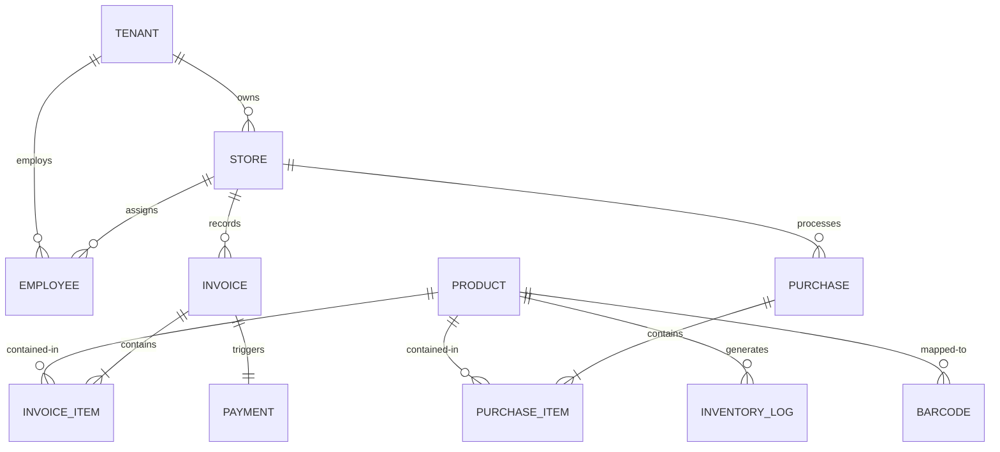
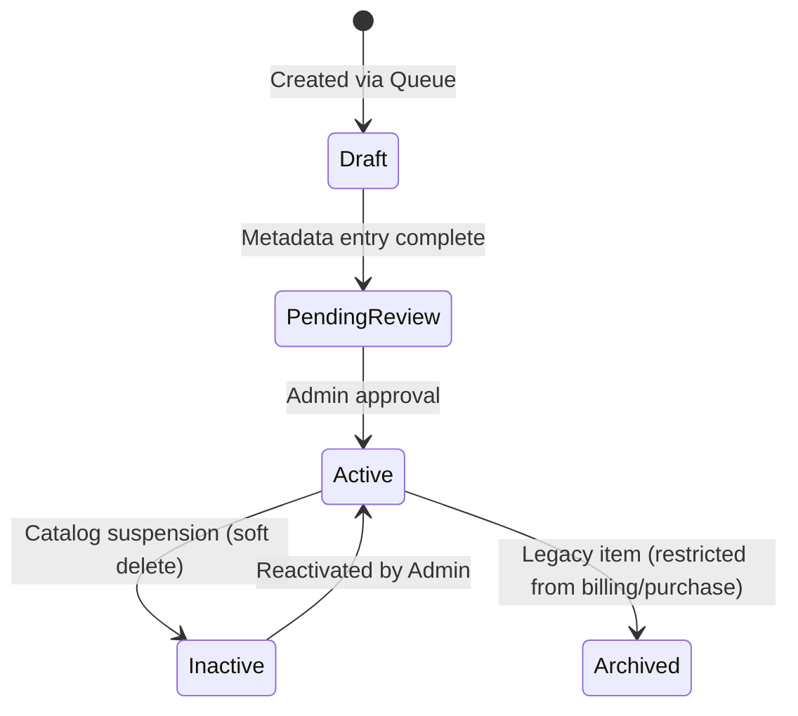

# AIavro Business OS - Software Architecture Document (SAD) v1.0

This document defines the software architecture, operational workflows, API standards, database models, and coding standards for the **AIavro Business OS** platform, beginning with the **AIavro Billing & Inventory Suite v2**.

---

## Chapter 1: Vision & Strategic Goals

AIavro Business OS is designed as a unified SaaS operating system for retail stores, supermarkets, and warehouse networks. The core objective is to replace fragmented software (billing terminals, standalone inventory trackers, CRM tools, and employee shifts) with a single, highly performant, multi-tenant real-time platform.

### Key Tenets
1. **Low-Latency Operations**: Offline-first design philosophies; POS operations (barcode scan-to-cart) must resolve sub-second.
2. **Unified Data Domain**: Shared core mathematics across all modules (GST calculations, discounts, inventory logs) preventing discrepancies between records.
3. **Decoupled Extensions**: Extensible event-driven architecture allowing easy plug-and-play addition of future AI analysis modules, automated notifications (e.g. WhatsApp, Email), and reporting pipelines.

---

## Chapter 2: Core Technology Stack & Ecosystem

| Component | Technology | Version | Purpose |
| :--- | :--- | :--- | :--- |
| **Frontend Core** | Next.js (App Router) | `15.x` / `16.x` | Server-Side Rendering (SSR), Server Components (RSC), and routing. |
| **State Store** | Zustand | `5.x` | Light, reactive client state storage. |
| **Server State** | TanStack Query | `5.x` | Client-side asynchronous query and cache sync. |
| **Styling** | Tailwind CSS / shadcn/ui | `v4.x` | Atomic styling framework and custom accessibility tokens. |
| **Animations** | Framer Motion | `11.x` | Micro-animations and page layout transitions. |
| **Backend Core** | NestJS | `11.x` | Enterprise OOP Node.js controller & dependency framework. |
| **Authentication** | Better Auth | Latest | Secure session management, MFA, and RBAC middlewares. |
| **Validation** | class-validator / Zod | Latest | Dynamic runtime parameter assertions. |
| **WebSockets** | Socket.IO | `4.x` | Real-time paired mobile scanner connectivity. |
| **Database** | MongoDB | `7.x` / `8.x` | Document store for high-write scale and flexible indexing. |
| **ODM / Interface**| Mongoose | `8.x` | Object Data Modeling and document mapping. |
| **DevOps / Infra** | Docker & Compose | Latest | Standardized localized micro-services containerization. |

---

## Chapter 3: Monorepo & Directory Structure

AIavro uses a workspace-based monorepo layout, separating user interface layers from backend controller routes, while sharing type definitions and business logic libraries.

```text
billing system/
├── apps/
│   ├── frontend/                 # Next.js 15/16 Client
│   │   ├── src/
│   │   │   ├── app/              # Page Router layouts and views
│   │   │   ├── components/       # Custom shadcn UI components
│   │   │   └── store/            # Zustand state containers
│   │   └── package.json
│   └── backend/                  # NestJS REST & WebSocket API Gateway
│       ├── src/
│       │   ├── auth/             # Better Auth route configurations
│       │   ├── billing/          # Checkout controller & modules
│       │   ├── inventory/        # Stock adjustments & onboarding
│       │   └── main.ts           # NestJS Server entry point
│       └── package.json
├── packages/
│   ├── domain/                   # @aiavro/domain: Core math (GST, Total, Round-offs)
│   ├── database/                 # @aiavro/database: Shared MongoDB Connection, Schemas & Models
│   ├── shared/                   # @aiavro/shared: Utility functions
│   └── types/                    # @aiavro/types: System-Wide TypeScript interfaces
├── docker/
│   ├── Dockerfile.frontend
│   ├── Dockerfile.backend
│   └── docker-compose.yml        # Multi-service container orchestrator
├── aiavro_billing_system.html    # High-fidelity prototype (Port 8181) for rapid previewing
├── server.js                     # Local prototype Node/Express server and mobile gateway
├── architect_view.md             # This document
└── package.json                  # Root monorepo workspace definition
```

---

## Chapter 4: Business Domains Architecture

The platform architecture divides functions into cleanly decoupled modules, ensuring clear responsibility boundaries.

```text
AIavro Business OS
├── 🔐 Authentication (Session management, Better Auth)
├── 🏢 Tenant Management (Organization registration, subscription validation)
├── 📍 Store Management (Multi-store locations directory, custom terminals)
├── 📦 Product Management (Product catalog, multi-barcode mappings, lifecycles)
├── 🧾 Purchase Management (Supplier directory, incoming purchase invoices, stocking)
├── 📉 Inventory (Stock levels tracker, damage/transfer adjustments ledger)
├── 🛒 Billing / POS (Checkout session registers, carts calculations, receipt print)
├── 💳 Payments (Cash drawer, UPI transactions, card ledger reconciliation)
├── 👥 Customer CRM (Customer profiles, GSTIN entries, loyalty points ledger)
├── 👔 Employee Directory (Roles administration, timesheet shifts records)
├── 📊 Reports & Analytics (GST tax slab distributions, margins, low-stock warnings)
└── ⚙️ System Settings (Mongoose backups, paired desktop/mobile devices settings)
```

---

## Chapter 5: Database Schema & Relationships

### Entity-Relationship Logical Model



### Mongoose ACID Transactions Enforcement
To prevent database corruption and partial ledger states, all operations affecting sales checkouts or supplier purchases **MUST** execute within an active MongoDB session transaction.

```javascript
// Example implementation pattern in NestJS Domain Services
const session = await this.connection.startSession();
session.startTransaction();
try {
  // 1. Create Invoice record
  // 2. Decrement stock counts in Catalog
  // 3. Insert Inventory Movement Logs
  // 4. Log Immutable Audit Trail
  await session.commitTransaction();
} catch (error) {
  await session.abortTransaction();
  throw error;
} finally {
  session.endSession();
}
```

---

## Chapter 6: API Standards & DTO Formats

All REST API endpoints must conform to versioned routing patterns starting with `/api/v1/`.

### Success Response Standard (2xx status codes)
```json
{
  "success": true,
  "message": "Invoice successfully registered.",
  "data": {
    "invoiceId": "AIAVRO-2026-0005",
    "grandTotal": 450.00
  }
}
```

### Error Response Standard (4xx/5xx status codes)
```json
{
  "success": false,
  "message": "Resource validation failed.",
  "errors": [
    {
      "field": "stock",
      "message": "Quantity cannot be less than zero."
    }
  ],
  "traceId": "req-9c8a-7729b"
}
```

---

## Chapter 7: Request Lifecycle & Authentication Flow

Security validations occur progressively before reaching domain modules:

```text
Incoming API HTTP Request
       ↓
Next.js Routing / Middleware
       ↓
NestJS API Gateway Controller
       ↓
Better Auth Session Interceptor (Tenant Id Extraction)
       ↓
RBAC Guard Permission Validator (Checks roles: ADMIN / EMPLOYEE / AUDITOR)
       ↓
Domain Service Business Logic
       ↓
Mongoose ODM / MongoDB Transaction
       ↓
Response Serialization (API Response Standard)
       ↓
TanStack Query Cache Update
       ↓
React UI View Rerender
```

---

## Chapter 8: Billing & POS Architecture

POS registers operate under session control. Cashiers open a checkout session to begin transactions and close it to reconcile totals.

```text
[Open Register Session]
           ↓
[New Invoice Instance Created]
           ↓
[Webcam / Scanner Cart Insertion]
           ↓
   Is Product Known?
     ├── YES: Add to Cart (Apply Domain GST Math & Discounts)
     └── NO:  Add unknown barcode to Onboarding Queue (Temporary placeholder)
           ↓
[Process Checkout Payment Selection]
           ↓
[MongoDB ACID Transaction execution (Stocks, Logs, Invoices)]
           ↓
[Print / View Thermal PDF Receipt]
           ↓
[Close Register Session & Reconcile Cash Drawer]
```

---

## Chapter 9: Purchase Entry & Inventory Workflows

The supplier purchase pipeline handles inventory replenishment and auto-onboarding for unregistered manufacturer barcodes.

### Supplier Incoming Stock Flow
```text
Cashier opens Purchase Entry
           ↓
Enters Supplier Invoice Ref ID & Selects Store Location
           ↓
Scans Product Barcodes
           ↓
   Is Product Profile Registered?
     ├── YES: Add to Purchase Entry Sheet (Increments quantity counter)
     └── NO:  Trigger Onboarding Flow ➔ Prompt Product Creation Form
                 ↓
              Submit New Product catalog profile (SKU prefilled from scanned barcode)
                 ↓
              Resume active Purchase Entry session without screen reload
           ↓
Submit Purchase Entry (Performs ACID transaction incrementing warehouse stock)
```

### Product Catalog Lifecycles

Products transition through distinct states to safeguard checkout registries:


---

## Chapter 10: Barcode & Phone Scanner System

The paired phone-scanner system decouples video processing to the mobile device and transmits barcodes instantly to the desktop POS terminal.

```text
[Desktop Billing View] ➔ Requests pairing session ➔ Renders Session QR Code
                                                          ↓
[Mobile App / Webpage] ➔ Scans Pairing QR Code ➔ Establishes paired Socket.IO Room
                                                          ↓
[Mobile Device Camera] ➔ Cashier scans product barcode
                                                          ↓
Socket.IO Server ➔ Decodes barcode ➔ Emits data to Paired Desktop POS Room
                                                          ↓
[Desktop POS cart handler] ➔ Plays scan audio beep ➔ Increments cart inventory
```

### Barcode Aliasing Support
Products can map to multiple barcodes (e.g. manufacturer barcodes, old system barcodes, internal stickers) by referencing a dedicated `barcodes` array in the product schema:
```typescript
interface Product {
  id: string;
  name: string;
  sku: string;          // Main SKU Identifier
  barcodes: string[];   // All secondary codes triggering this product profile
}
```

---

## Chapter 11: Multi-Tenant SaaS Layer

To maintain absolute data isolation between different clients (tenants), every database collection holds a reference to a `tenantId`.

### Header Validation Interceptor
Every request sent to the API must include the following headers:
*   `x-tenant-id`: Identifies the client organization.
*   `x-store-id`: Identifies the current physical store branch.

```typescript
// NestJS Tenant Isolation Interceptor
@Injectable()
export class TenantIsolationInterceptor implements NestInterceptor {
  intercept(context: ExecutionContext, next: CallHandler): Observable<any> {
    const request = context.switchToHttp().getRequest();
    const tenantId = request.headers['x-tenant-id'];
    const storeId = request.headers['x-store-id'];

    if (!tenantId) {
      throw new BadRequestException('Missing x-tenant-id header.');
    }
    
    // Inject parameters directly into query contexts
    request.tenantId = tenantId;
    request.storeId = storeId;
    return next.handle();
  }
}
```

---

## Chapter 12: Deployment & DevOps Architecture

### Infrastructure Topology

```text
                             Cloudflare DNS & WAF
                                      ↓
                                Nginx Proxy
                                      ↓
         ┌────────────────────────────┴────────────────────────────┐
         ↓                                                         ↓
Next.js Frontend (Port 3000)                             NestJS API (Port 3001)
         │                                                         │
         └────────────────────────────┬────────────────────────────┘
                                      ↓
                               Mongoose Connect
                                      ↓
                         MongoDB Container (Port 27017)
                                      │
                         Shared Persistent Volumes
                                      │
                         Backup cron task (S3 upload)
```

### Docker Compose Container Layout
Services are orchestrated using isolated network interfaces with external mount points for databases and log assets.

```yaml
version: '3.8'
services:
  database:
    image: mongo:8.0
    container_name: aiavro_mongodb
    ports:
      - "27017:27017"
    volumes:
      - mongodb_data:/data/db
      - mongodb_backups:/data/backups

  backend:
    build:
      context: ../
      dockerfile: docker/Dockerfile.backend
    container_name: aiavro_backend
    ports:
      - "3001:3001"
    environment:
      - MONGO_URI=mongodb://database:27017/aiavro
    depends_on:
      - database

  frontend:
    build:
      context: ../
      dockerfile: docker/Dockerfile.frontend
    container_name: aiavro_frontend
    ports:
      - "3000:3000"
    depends_on:
      - backend

volumes:
  mongodb_data:
  mongodb_backups:
```

---

## Chapter 13: Backup, Disaster Recovery & Monitoring

### Backup Pipeline (Cron Job)
Daily automated backups run at midnight server time.
```bash
#!/bin/bash
# Midnight backup script
TIMESTAMP=$(date +"%Y%m%d_%H%M%S")
BACKUP_DIR="/data/backups/dump_$TIMESTAMP"

# Perform mongodump
mongodump --host database --db aiavro --out "$BACKUP_DIR"

# Compress
tar -czf "/data/backups/backup_$TIMESTAMP.tar.gz" "$BACKUP_DIR"
rm -rf "$BACKUP_DIR"

# Sync to secure S3 storage
aws s3 cp "/data/backups/backup_$TIMESTAMP.tar.gz" "s3://aiavro-backups/prod/"
```

### Production Monitoring Suite
1. **Pino Logging Engine**: Configured to stream structured JSON logs to container standard outputs.
2. **Health Check Endpoints**: Standard `/health` route returning DB latency metrics and storage limits.
3. **Slow Query Tracking**: MongoDB Profiler configured to log operations exceeding `150ms`.

---

## Chapter 14: Coding & Architecture Standards

1.  **Zero Direct Logic in Controllers**:
    NestJS controllers must act only as transport routes. Validate payloads via DTOs, delegate operations to domain services, and return responses.
2.  **Domain Package Calculations Lock**:
    Calculations of GST, discounts, and invoices values must live inside `@aiavro/domain`. They cannot be rewritten inside client components or database scripts.
3.  **DRY (Don't Repeat Yourself)**:
    Database schema constraints, DTO classes, and interfaces are generated once inside `@aiavro/types` and `@aiavro/database` and shared across frontend and backend scopes.

---

## Chapter 15: Performance Targets

These metrics are validated during automated CI/CD performance testing:

| User Action | Target Latency | Threshold / SLA |
| :--- | :--- | :--- |
| **Barcode scan to cart lookup** | `< 100ms` | SLA 150ms |
| **POS interface update on scan** | `< 250ms` | SLA 400ms |
| **Invoice database processing** | `< 350ms` | SLA 600ms |
| **User session authentication** | `< 800ms` | SLA 1200ms |
| **Dashboard analytics aggregation** | `< 1.5s` | SLA 2.5s |

---

## Chapter 16: Future Event-Driven Architecture Roadmap

To maintain decoupling, all transactional completions publish events. Future micro-services subscribe to these topics to process tasks.

```text
[Invoice Billed / Paid]
           ↓
Publish Event: "invoice.completed"
           ↓
   ┌───────┼─────────────────────────┬────────────────────────┐
   ↓       ↓                         ↓                        ↓
[Inventory] [Tax Reports]      [Audit Tracker]     [WhatsApp Notifier]
Deducts stock Updates GST logs Writes audit entry  Sends customer bill
```

Future AI modules will plug directly into this stream by listening to `"invoice.completed"` to generate real-time product recommendations.
