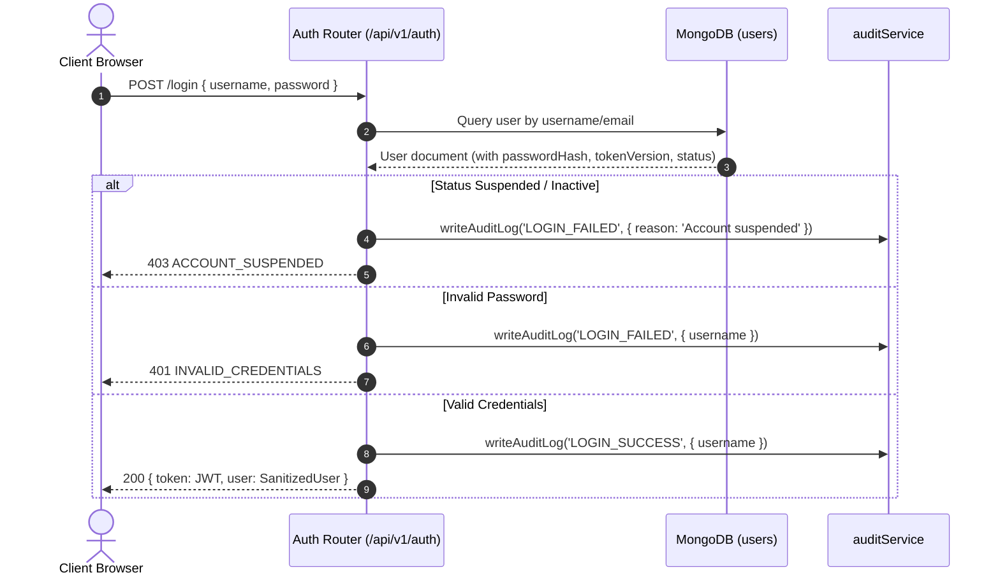

# Authentication & Session Security Hardening

## 1. Authentication Lifecycle



---

## 2. Token Versioning & Instant Session Revocation

### The Problem
Previously, JWT tokens had a fixed 24-hour expiration window. When a user changed their password, was suspended by an administrator, or had their credentials compromised, the previously issued token remained cryptographically valid for 24 hours.

### The Solution: `tokenVersion`
1. Every user record in the `users` collection contains an integer field `tokenVersion` (initial value: `1`).
2. When a token is signed during `POST /api/v1/auth/login`, `tokenVersion` is embedded into the payload:
   ```json
   {
     "id": "usr-123",
     "username": "cashier1",
     "role": "Employee",
     "category": "employee",
     "assignedStoreId": "store-blr-1",
     "tokenVersion": 1
   }
   ```
3. Whenever a user:
   - Changes their password via `/api/v1/auth/change-password` or `/api/v1/users/change-password`
   - Has their password reset by an administrator via `POST /api/v1/users`
   - Is suspended / deactivated via `POST /api/v1/users/:id/deactivate`
   
   The database record atomically increments `tokenVersion`:
   ```javascript
   await db.collection('users').updateOne(
     { id: userId },
     {
       $set: { passwordHash: newHash, updatedAt: new Date().toISOString() },
       $inc: { tokenVersion: 1 }
     }
   );
   ```
4. On every authenticated request, `verifyJWT` verifies that `dbUser.tokenVersion === decoded.tokenVersion`.
   If a mismatch is detected, the request is immediately rejected with:
   ```json
   {
     "success": false,
     "error": {
       "code": "SESSION_REVOKED",
       "message": "Session has been invalidated. Please log in again."
     }
   }
   ```

---

## 3. Removal of Master Reset Credentials
- Hardcoded frontend master passwords (such as `MASTER_RESET_PASSWORD = "Raja123$;"`) have been **completely eliminated** from `aiavro_billing_system.html`.
- No client-side bypasses or synthetic Super Admin bypasses exist.
- All authentication flows strictly resolve through the database and cryptographic Bcrypt hashing.
