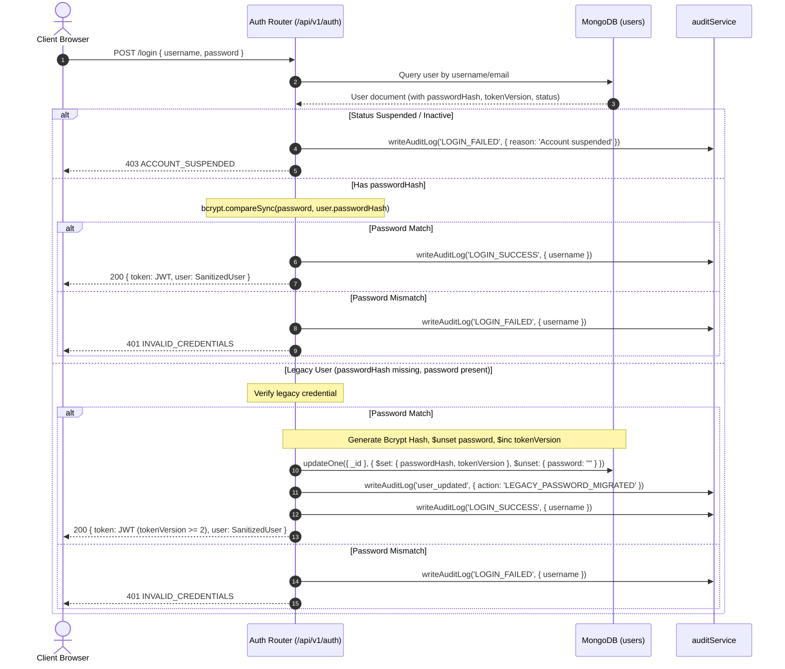

# Authentication & Session Security Hardening

## 1. Authentication Lifecycle



---

## 2. Legacy Plaintext Password Migration & Elimination

### The Problem
Historical imported or seed user records may have retained a legacy `password` field without a Bcrypt `passwordHash`. Previous code allowed a generic fallback comparison `user.passwordHash || user.password`.

### The Security Hardening Patch
1. **Generic Fallback Removed**: The API no longer uses `user.passwordHash || user.password`.
2. **Controlled On-Login Migration**:
   - When a legacy user (such as `rajesh`) logs in with their existing valid credential:
     - A salted Bcrypt hash (`bcrypt.hashSync(password, 12)`) is generated.
     - The MongoDB document is atomically updated:
       ```javascript
       await db.collection('users').updateOne(
         { _id: user._id },
         {
           $set: { passwordHash: newHash, tokenVersion: tokenVersion, updatedAt: new Date().toISOString() },
           $unset: { password: "" }
         }
       );
       ```
     - The plaintext `password` field is permanently deleted from the database.
     - `tokenVersion` is incremented to at least `2`.
     - Future logins strictly evaluate against `user.passwordHash`.
3. **New User Creation & Admin Updates**:
   - New users are created with `passwordHash` only. The `password` field is never written.
   - Admin password updates calculate a Bcrypt hash, remove any legacy `password` field (`$unset: { password: "" }`), and increment `tokenVersion`.

---

## 3. Token Versioning & Instant Session Revocation

1. Every user record in the `users` collection contains an integer field `tokenVersion` (initial value: `1`).
2. When a token is signed during `POST /api/v1/auth/login`, `tokenVersion` is embedded into the payload:
   ```json
   {
     "id": "usr-123",
     "username": "cashier1",
     "role": "Employee",
     "category": "employee",
     "assignedStoreId": "store-blr-1",
     "tokenVersion": 1
   }
   ```
3. Whenever a user:
   - Changes their password via `/api/v1/auth/change-password` or `/api/v1/users/change-password`
   - Has their password reset by an administrator via `POST /api/v1/users`
   - Undergoes legacy password migration on first login
   - Is suspended / deactivated via `POST /api/v1/users/:id/deactivate`
   
   The database record atomically increments `tokenVersion`:
   ```javascript
   await db.collection('users').updateOne(
     { id: userId },
     {
       $set: { passwordHash: newHash, updatedAt: new Date().toISOString() },
       $inc: { tokenVersion: 1 }
     }
   );
   ```
4. On every authenticated request, `verifyJWT` verifies that `dbUser.tokenVersion === decoded.tokenVersion`.
   If a mismatch is detected, the request is immediately rejected with:
   ```json
   {
     "success": false,
     "error": {
       "code": "SESSION_REVOKED",
       "message": "Session has been invalidated. Please log in again."
     }
   }
   ```

---

## 4. Removal of Master Reset Credentials
- Hardcoded frontend master password constants (`MASTER_RESET_PASSWORD = "[REDACTED]"`) have been **completely eliminated** from `aiavro_billing_system.html`.
- No client-side bypasses or synthetic Super Admin bypasses exist.
- All authentication flows strictly resolve through the database and cryptographic Bcrypt hashing.
