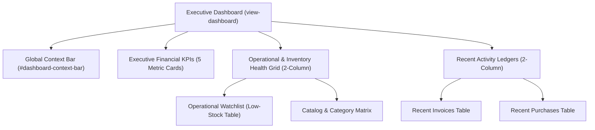

# Dashboard Intelligence & Executive Workspace Implementation (Phase C)

**Stage:** Stage 13 — Phase C Implementation  
**Status:** Completed & Verified (119/119 Automated Tests Passing)  
**Deliverables:** Executive Workspace, Real-time Attention Watchlist, Financial KPIs & Multi-Store Aggregation

---

## 1. Executive Summary

Phase C transforms the application dashboard into an Executive Command Center tailored for agro-enterprise and retail operations. The interface prioritizes actionable operational intelligence:
1. **What needs immediate attention?** (Low-stock & out-of-stock items requiring replenishment).
2. **What happened today?** (Live stream of recent customer sales invoices & vendor purchase inflows).
3. **How is the business performing?** (Gross sales, net profit margins, retail vs cost asset valuations, franchise partner settlements).
4. **What actions should the user take next?** (Instant POS Checkout via `F1`, Master Inventory inspection via `F2`).

All dashboard information is derived directly from the authoritative backend endpoint `GET /api/v1/dashboard/metrics` with zero client-side raw data downloading, zero schema mutations, and zero demo/sample records.

---

## 2. Information Hierarchy & Component Structure

### 2.1 Global Context Bar
- **Active Store Badge:** Reflects consolidated enterprise mode or single-store scoped filtering (`#dashboard-active-outlet-name`, `#dashboard-active-outlet-status`).
- **Last Updated Stamp:** Dynamic timestamp reflecting last successful server synchronization (`#dashboard-last-updated`).
- **Quick Action Toolbar:** Direct trigger for POS Checkout (`F1`) and Metrics Refresh (`initDashboardAnalytics()`).

### 2.2 Executive Financial KPIs
- **Gross Revenue (`#metric-total-sales`):** Aggregate sum of completed invoices.
- **Net Farm Profit (`#metric-net-profit`):** Authoritative gross sales minus COGS from MongoDB aggregation.
- **Stock Valuation Retail (`#metric-asset-valuation-retail`):** Current inventory retail valuation.
- **Stock Valuation Cost (`#metric-asset-valuation-cost`):** Current inventory procurement asset cost.
- **Franchise Settlements (`#metric-franchise-earnings`):** Settled franchise supply orders.

### 2.3 Operational Attention & Catalog Health
- **Operational Watchlist (`#dashboard-low-stock-watchlist`):** Top 5 products at or below reorder threshold with thumbnail, SKU badge, current stock, and instant "Restock" action.
- **Catalog Matrix:** Total SKUs, Farm/Own Items, External Brands, Low Stock count, Out of Stock count, and Tax Categories.

### 2.4 Recent Activity Ledgers
- **Recent Invoices (`#dashboard-recent-invoices`):** Last 5 sales transactions with invoice number, customer name, payment mode badge, amount, and preview trigger.
- **Recent Purchases (`#dashboard-recent-purchases`):** Last 5 vendor purchase receipts with reference number, supplier name, store location, and total cost.

---

## 3. Backend Contract & Performance Architecture

- **Endpoint:** `GET /api/v1/dashboard/metrics`
- **Scoping:** Fully honors `storeId` query param and non-superadmin store assignments.
- **Payload Safety:**
  - Invoices and Purchases projected with `{ items: 0 }` and capped at `.limit(5)` to avoid megabyte payload transfers.
  - Financial calculations, valuations, and watchlist sorting are executed server-side in MongoDB pipelines.
  - Zero raw collection dumps in browser memory.

---

## 4. Real-time Synchronization

- Socket.IO listeners (`invoice_created`, `product_updated`, `inventory.updated`) check if `state.activeView === 'dashboard'` and seamlessly invoke `initDashboardAnalytics()`.
- Updates occur reactively without page reloads or polling loops.

---

## 5. Verification & Automated Test Coverage

- **Test Suite (`tests/dashboardRedesign.test.js`)**:
  - Validates metrics API contract and financial calculations.
  - Validates all DOM elements and KPI containers in `aiavro_billing_system.html`.
  - Validates watchlist and recent transaction rendering.
  - Validates socket event reactivity.
- **Total Test Suite Status:** **119/119 tests passing** across 14 test suites.
- **HTML Inline JS Validation:** All 28 script blocks compiled and verified.
