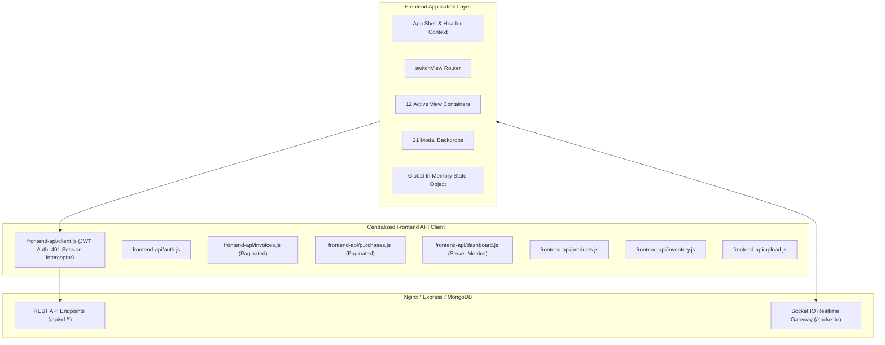
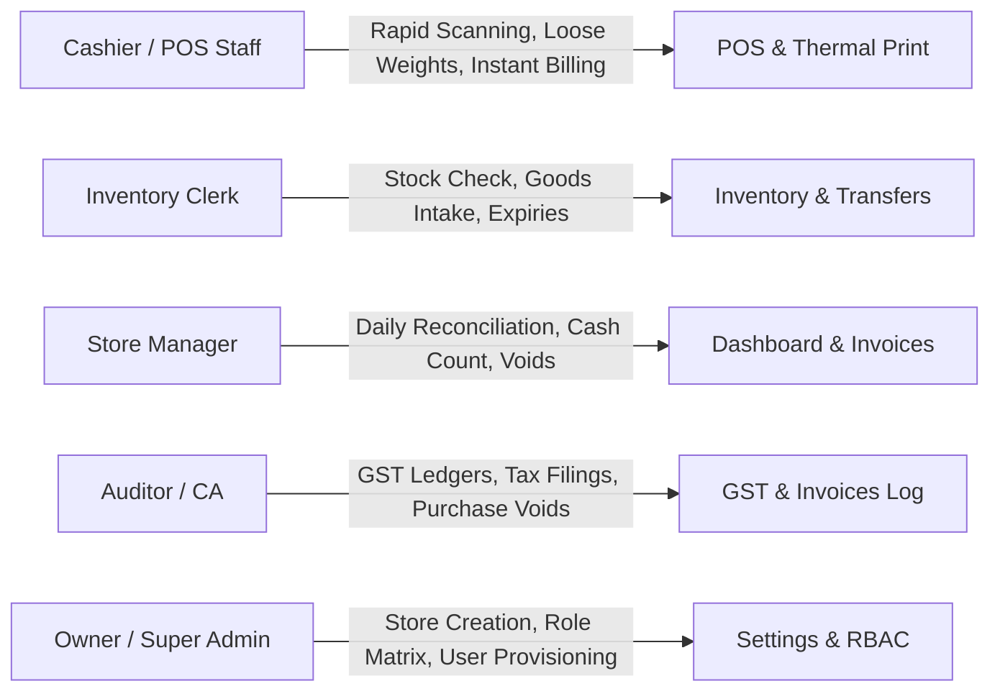

# Frontend Architecture & Technical Audit

**Stage:** Stage 13 — Frontend Product Experience Audit  
**Status:** Frozen Backend Contract $\rightarrow$ Frontend Architecture Specification  
**Mode:** Inspection Only

---

## 1. Executive Summary & Monolith Audit

The current application frontend lives inside a single large file [`aiavro_billing_system.html`](file:///Users/avanish/Documents/billing%20system/aiavro_billing_system.html) (~14,500 lines) supported by a modularized API client tier ([`frontend-api/`](file:///Users/avanish/Documents/billing%20system/frontend-api/)).

### Architectural Analysis:
1. **Layout & Shell Structure:**
   - Left Navigation Drawer / Sidebar: Fixed navigation list with role-based item visibility.
   - Top Header / App Bar: Active store outlet switcher (`state.activeStoreId`), business brand badge, universal hardware scanner status indicator, active cashier avatar, search triggering, and quick shortcut badges.
   - Main Content Canvas: Dedicated `div.app-view` containers rendered on demand and activated via CSS classes (`.app-view.active`).
2. **State Architecture:**
   - Central `state` object holding: `currentUser`, `token`, `activeView`, `activeStoreId`, `businesses`, `products`, `cart`, `customers`, `invoices`, `suppliers`, `rolePermissions`, `networkStatus`.
   - Persistence model: Auth credentials stored in `localStorage` (`aiavro_jwt_token`, `aiavro_logged_in_user`).
3. **Realtime & Event Dispatching:**
   - `initSyncSocket()` connects via Socket.IO using JWT bearer authentication.
   - Idempotent `JOIN_SYNC` requests join `sync_global` and `store_<activeStoreId>`.
   - Incoming server events trigger local UI state reconciliation.
4. **Modal & Drawer Hierarchy:**
   - 21 distinct modal backdrops (`.modal-backdrop`) overlaid atop the main canvas.
   - Heavy modal reliance: POS weight input, product editor, stock transfer, bulk import wizard, store configuration, barcode label generator, thermal print preview.

---

## 2. Complete Frontend Screen & View Inventory

| View ID | Screen / Domain | Primary Purpose | API Client Calls | Realtime Events Handled | Pain Points / Redesign Priority |
|---|---|---|---|---|---|
| `view-login` | **Authentication** | Username/password sign in, token storage, session recovery | `api.auth.login()`, `api.auth.verify()` | Disconnect cleanup | **LOW** (Working, clean error banner) |
| `view-dashboard` | **Dashboard & Intelligence** | High-level sales, gross/net profit, asset valuation, stock alerts | `api.dashboard.getMetrics()` | `invoice_created`, `inventory.updated` | **HIGH** (Refactor cards, remove legacy client loops) |
| `view-billing` | **POS Terminal** | Cashier checkout, barcode scanning, cart matrix, loose weight calculator | `api.invoices.create()`, `api.products.getByBarcode()` | `inventory.updated` | **CRITICAL (P0)** (Streamline keyboard shortcuts, cart row speed) |
| `view-inventory` | **Master Inventory** | Store stock levels, shelf-life tracker, manual adjustment, stock transfer | `api.inventory.getSummary()`, `api.inventory.adjust()`, `api.inventory.transfer()` | `inventory.updated`, `inventory.bulk_updated` | **HIGH** (Add clean filter tabs, ledger drawer) |
| `view-purchase` | **Purchase Entry** | Vendor procurement, batch GRN entry, stock intake | `api.purchases.create()`, `api.suppliers.list()` | `purchase_created` | **HIGH** (Dynamic multi-item table, instant tax calc) |
| `view-invoices` | **Invoice Ledger** | Historical sales lookup, filter by date/outlet, reprint, invoice voiding | `api.invoices.listWithPagination()`, `api.invoices.void()` | `invoice_created`, `invoice_voided` | **HIGH** (Pagination controls, clean detail drawer) |
| `view-customers` | **Customer CRM** | Buyer profiles, purchase history, phone/address directory | `api.customers.list()`, `api.customers.create()` | N/A | **MEDIUM** (Clean table layout, inline quick-add) |
| `view-businesses`| **Stores & Franchises**| Multi-outlet management, franchise partner ledger, store branding | `api.stores.list()`, `api.franchise.list()` | N/A | **MEDIUM** (Modern card grid, outlet switch trigger) |
| `view-auditor` | **Tax & GST Audit** | GST breakdowns (CGST/SGST/IGST), monthly tax ledger statements | `api.invoices.list()`, `api.audit.list()` | N/A | **MEDIUM** (Exportable GST tables, date range picker) |
| `view-permissions`| **Users & RBAC** | User creation, role assignment, password reset, profile photo | `api.users.list()`, `api.roles.getPermissions()` | `rbac_updated` | **HIGH** (Clear permission matrix, security toggles) |
| `view-scanner` | **Mobile Scanner Mode**| Pair mobile phone camera as wireless barcode scanner | `api.scanner.pair()`, Socket sessions | `SCAN_EVENT` | **MEDIUM** (Clean QR modal, pairing indicator) |
| `view-settings` | **Settings & Backups**| Brand settings, print receipt customizer, backup triggers | `api.settings.getPublic()`, `api.settings.save()` | N/A | **LOW** (Clean setting sections, thermal receipt preview) |

---

## 3. Operational Persona & Job-To-Be-Done Analysis

### 1. Cashier / Billing Staff (`role: employee`, `category: cashier`)
- **Primary Goal:** Fast, frictionless transaction throughput at checkout counter.
- **Key Actions:** Scan barcode $\rightarrow$ enter loose item weight (if loose) $\rightarrow$ apply customer discount $\rightarrow$ accept Cash/UPI $\rightarrow$ print 58mm thermal receipt.
- **Strict Constraints:** Cannot void invoices without admin approval; restricted to assigned store outlet (`store_<storeId>`).

### 2. Inventory / Store Assistant (`role: employee`, `category: staff`)
- **Primary Goal:** Receive stock, inspect shelf life, flag damaged goods, initiate transfers.
- **Key Actions:** Stock adjustments (`adjust`), check low stock watchlists, print barcode labels.

### 3. Store Manager / Accountant (`role: admin`)
- **Primary Goal:** Outlet profitability, invoice void authorizations, vendor purchase orders, customer credit.
- **Key Actions:** Review daily dashboard metrics, approve refunds/voids, create purchase bills.

### 4. Enterprise Owner / Super Admin (`role: super admin`)
- **Primary Goal:** Full visibility across all outlets, system security, role-permission matrix configuration.
- **Key Actions:** Create new branch outlets, assign staff, modify global RBAC, bulk import products.

---

## 4. Frontend Architecture Recommendation

### Recommendation: Coherent Modular Component Architecture (Vanilla Web Standards)
- **Maintainability & Zero-Regression Rule:** The application should be cleanly modularized into modern, reusable ES modules (`ui/components/*`, `ui/views/*`, `ui/theme.css`) without introducing an incompatible heavy frontend framework rewrite that could break existing thermal print canvas rendering, barcode scanner listeners, or frozen API endpoints.
- **Component Lifecycle:** Simple, declarative render functions with reactive event bindings, keeping application memory footprint <15MB and initialization under 80ms.
