# High-Speed POS Terminal Implementation (Phase D)

**Stage:** Stage 13 — Phase D Implementation  
**Status:** Completed & Verified (128/128 Automated Tests Passing)  
**Deliverables:** High-Speed Retail Billing Terminal, Keyboard-First Workflow, Dynamic Loose Weight Matrix & Thermal/A4 Print Integration

---

## 1. Executive Summary

Phase D transforms the retail checkout into a high-speed, professional POS Terminal tailored for rapid grocery, dairy, and farm outlet transactions. The target interaction flow is optimized for minimal cognitive load and zero unnecessary clicks:

```
[SEARCH / SCAN SKU] 
       ↓
[SELECT / DYNAMIC WEIGHT] 
       ↓
[ACTIVE CART BASKET] 
       ↓
[CUSTOMER / DISCOUNT] 
       ↓
[TENDER METHOD] 
       ↓
[COMPLETE SALE (F9 / ENTER)] 
       ↓
[PRINT THERMAL 58mm / A4]
```

All billing calculations (subtotal, item-wise GST rate, proportional discount allocation, roundoff) and stock commitments strictly consume the frozen backend contracts with zero database schema mutations and zero fake data.

---

## 2. Terminal Layout & Component Hierarchy

```mermaid
graph TD
    POSTerminal["POS Terminal Workspace (#view-billing)"]
    LeftPanel["Product Catalog & Search Panel (60%)"]
    RightPanel["Cart & Tender Workspace (40%)"]
    
    SearchRow["Search Bar & Hardware Scanner Trigger"]
    CategoryPills["Category Filter Pills (Horizontal Scroll)"]
    ProductsGrid["Product Catalog Grid (Responsive Cards)"]
    
    CartHeader["Cart Header & Quick Clear Action"]
    ScannedVerify["Scanned Product Verification Banner"]
    CartList["Cart Items List (Stepper & Weight Inputs)"]
    EntitySelectors["Outlet & Customer Selectors"]
    TotalsSummary["Tabular Calculations Summary"]
    PaymentModes["Tender Grid (Cash, UPI QR, Card, Bank)"]
    CheckoutAction["Complete Sale Action (#pos-generate-bill-btn)"]

    POSTerminal --> LeftPanel
    POSTerminal --> RightPanel
    
    LeftPanel --> SearchRow
    LeftPanel --> CategoryPills
    LeftPanel --> ProductsGrid
    
    RightPanel --> CartHeader
    RightPanel --> ScannedVerify
    RightPanel --> CartList
    RightPanel --> EntitySelectors
    RightPanel --> TotalsSummary
    RightPanel --> PaymentModes
    RightPanel --> CheckoutAction
```



---

## 3. Key Interaction & Operational Features

### 3.1 Fast Product Search & Barcode Scan
- **Default Focus:** Opening the POS Terminal automatically focuses `#pos-product-search`.
- **Universal Scanner Integration:**
  - Hardware USB HID scanners & Bluetooth wireless scanners trigger instant `handleUniversalBarcodeScan()` with sub-100ms keydown buffering.
  - Generates positive sine-wave audio confirmation (`880Hz`) on successful barcode match and sawtooth alert on unknown code.
  - Instant Scanned Product Verification panel displays image thumbnail, product title, SKU, MRP vs selling rate, and available stock.

### 3.2 Dynamic Loose-Weight Matrix
- Loose products (e.g. fresh milk, paneer, ghee, curd) trigger the dynamic loose weight modal configured via `WEIGHT_UNIT_CONFIG`:
  - **Grams (`g`):** Presets `100g`, `250g`, `500g`, `1kg` (divisor 1000).
  - **Milliliters (`ml`):** Presets `100ml`, `250ml`, `500ml`, `1L` (divisor 1000).
  - **Kilograms (`kg`):** Presets `0.5kg`, `1kg`, `2kg`, `5kg` (divisor 1).
  - **Liters (`L`):** Presets `0.5L`, `1L`, `2L`, `5L` (divisor 1).
- Live calculation reflects exact fractional quantity and price in real-time.

### 3.3 Cart UX & Inline Editing
- **Packaged Items:** Increment `+` / Decrement `-` buttons with stock validation limits.
- **Loose Items:** Inline numeric input with unit suffix (`g`, `ml`, `kg`, `L`) allowing custom weights without reopening modals.
- **Clear Empty State:** Displays `"Scan a product barcode or select an item from the catalog to begin."` when basket is empty.
- **Quick Clear Basket:** Dedicated `Clear` button in the cart header.

### 3.4 Financial Calculations & Tender Methods
- **Subtotal & Discounts:** Supports percentage (`%`) or absolute currency (`₹`) discounts with proportional item-wise tax apportionment.
- **Item-Wise GST Calculation:** Computes true tax on taxable value after discount allocation.
- **Round-Off Adjustment:** Automatically calculates mathematical round-off to integer currency values.
- **Tender Methods:** Quick selection across Cash, UPI QR, Card, and Bank Transfer.

### 3.5 Checkout State Machine & Duplicate Click Protection
- `READY`: Checkout button active with hotkey badge `⚡ Complete Sale & Print [F9]`.
- `PROCESSING`: Checkout button disabled with `⏳ Processing Checkout...` preventing duplicate transaction submissions.
- `SUCCESS`: Invoice stored, cart cleared, stock updated in state, and print preview modal (`openInvoicePreviewModal`) triggered immediately.
- `FAILED`: Clear error alert displayed with automatic button unlock.

---

## 4. Keyboard-First Shortcuts

| Shortcut | Function | Context |
| :--- | :--- | :--- |
| **`F1`** | Switch to POS Retail Terminal & Focus Search | Global App Shell |
| **`F2`** | Switch to Master Inventory | Global App Shell |
| **`F9`** | Trigger Checkout & Print Transaction | POS Terminal (when cart has items) |
| **`Escape`** | Close Active Modal / Dialog / Drawer | Global App Shell |
| **`Enter`** | Add Single Search Result / Confirm Weight | Search Input / Weight Modal |

---

## 5. Verification & Automated Test Coverage

- **Automated Regression Suite (`tests/posRedesign.test.js`)**:
  - 9 comprehensive unit and integration tests covering POS shell structure, barcode lookup, cart operations, quantity adjustments, stock validation, customer selection, payment modes, duplicate checkout locking, and authoritative invoice creation.
- **Total Test Suite Status:** **128/128 tests passing** across 15 test suites.
- **HTML Inline JS Verification:** All 28 script blocks compiled and verified.
