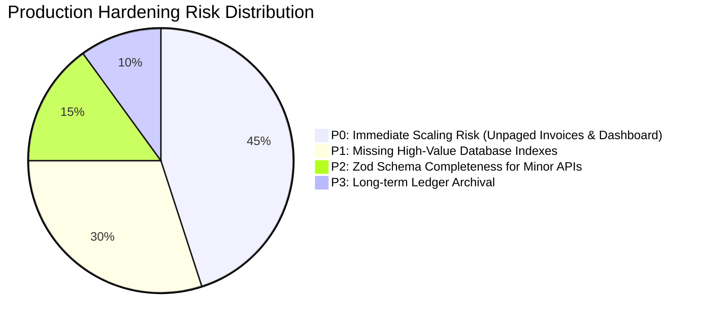

# Stage 12: Production Data Integrity, Validation & Performance Inspection Report

**Date:** August 14, 2026  
**Status:** Complete Production Hardening Inspection & Scale Audit  
**Mode:** Inspection Only (No code, database records, or indexes modified)

---

## 1. Database Integrity & Collection Architecture

The production MongoDB database (`vc_organic`) currently contains 17 active collections across 12 domain boundaries:

| Collection Name | Domain Owner | Primary Keys / Identifiers | Uniqueness Rules | Soft Delete Strategy | Relationships / References |
|---|---|---|---|---|---|
| `users` | Identity (`userService.js`) | `id` (`usr-...`), `username` | Unique `username`, `id` | `status: 'suspended'` | Scoped to `assignedStoreId` / `assignedStores` |
| `role_permissions` | RBAC (`settings.js`) | `role` (`admin`, `employee`, etc.) | Unique `role` | In-place update | References module permissions |
| `businesses` | Tenant (`businesses.js`) | `id` (`biz-...`) | Unique `id` | Physical `deleteOne` | 1-to-many with `stores` and `products` |
| `stores` | Outlets (`stores.js`) | `id` (`store-...`, `biz-...`) | Unique `id` | Physical `deleteOne` | Belongs to `businessId` |
| `products` | Catalog (`products.js`) | `id` (`prod-...`), `sku` | Unique `sku`, sparse `barcode` | `isArchived: true`, `status: 'archived'` | Foreign `categoryId`, `brandId`, `supplierId` |
| `product_barcodes` | Barcode Matrix (`products.js`) | `id`, `barcode` | Unique `barcode` per active item | `active: false` | Belongs to `productId`, `variantId` |
| `product_images` | Media (`upload.js`) | `id` (`img-...`) | Unique `id` | None | References `productId` |
| `inventory` | Stock (`inventoryService.js`) | `_id`, compound `(productId, locationId)` | Unique `(productId, locationId)` | None (Zero stock) | References `productId`, `locationId` |
| `inventory_ledger` | Ledger (`inventoryService.js`) | `movementId` (`mov-...`), `id` | Unique `movementId` | Immutable append-only | References `productId`, `locationId`, `referenceId` |
| `invoices` | Billing (`billing.js`) | `invoiceNumber` (`INV-...`), `transactionId` | Unique `invoiceNumber`, `transactionId` | `status: 'VOIDED'`, `isArchived: true` | References `customerId`, `locationId`, items `productId` |
| `purchases` | Procurement (`purchases.js`) | `id` / `purchaseId` (`PUR-...`) | Unique `id` | `status: 'VOIDED'`, `isArchived: true` | References `supplierId`, `locationId`, items `productId` |
| `customers` | CRM (`customers.js`) | `id` (`cust-...`), `phone` | Unique `phone` (business logic) | Physical `deleteOne` | Invoices link via `customerId` / `customerPhone` |
| `suppliers` | Procurement (`suppliers.js`) | `id` (`sup-...`), `phone` | Unique `phone` / `name` | Physical `deleteOne` | Purchases link via `supplierId` |
| `franchises` | Franchise (`franchise.js`) | `id` (`fran-...`) | Unique `id` | Physical `deleteOne` | Franchise orders link via `franchiseId` |
| `franchise_supply_orders`| Franchise (`franchise.js`) | `orderId` (`ord-...`) | Unique `orderId` | None | References `franchiseId`, items `productId` |
| `audit_logs` | Security (`auditService.js`) | `logId` (`aud-...`), `id` | Unique `logId` | Immutable append-only | References `userId`, `storeId`, `entityId` |
| `import_sessions`| Bulk Import (`bulkImportService.js`) | `importId` (`imp-...`) | Unique `importId` | Auto-retained session status | References `createdBy` |

---

## 2. Database Index Audit & Startup Warnings

### Current Defined Indexes (`server.js:289-295`):
1. `products`: `{ sku: 1 }` (`unique: true, sparse: true`)
2. `products`: `{ barcode: 1 }` (`sparse: true`)
3. `products`: `{ name: "text", category: "text", brand: "text" }`
4. `product_barcodes`: `{ barcode: 1 }`
5. `product_barcodes`: `{ productId: 1 }`
6. `inventory_ledger`: `{ createdAt: -1, productId: 1, locationId: 1 }`

### Identified Index Gaps & Redundancies:
- **Index Name Collision Warning:** During server restart, MongoDB logs `Index already exists with different options` when `createIndex` is executed against existing indexes created with default collation or legacy naming.
- **Missing High-Frequency Lookup Indexes:**
  - `invoices`: Missing `{ locationId: 1, createdAt: -1 }`, `{ invoiceNumber: 1 }` (unique), `{ transactionId: 1 }`.
  - `inventory`: Missing compound unique index `{ productId: 1, locationId: 1 }` (relies on query matching `$or: [{ locationId }, { storeId }]`).
  - `purchases`: Missing `{ locationId: 1, createdAt: -1 }`, `{ supplierId: 1 }`.
  - `users`: Missing `{ username: 1 }` (unique), `{ id: 1 }` (unique).
  - `audit_logs`: Missing `{ timestamp: -1 }`, `{ storeId: 1, timestamp: -1 }`, `{ userId: 1 }`.
  - `customers`: Missing `{ phone: 1 }`.
  - `suppliers`: Missing `{ phone: 1 }`.

---

## 3. Query Performance & Memory Scalability Analysis

```mermaid
flowchart LR
    Browser[Client Browser] -->|Full Collection Sync| API[REST Endpoints]
    API -->|find({}) Full Table Scan| DB[(MongoDB)]
    DB -->|All Historical Records| API
    API -->|MBs of Unpaged JSON| Browser
    Browser -->|O(N*M) Client-side Aggregation| Memory[Browser DOM & Memory]
```

### Critical Scalability Findings:
1. **Unbounded Full Table Scans:**
   - `GET /api/v1/invoices`: Fetches all non-archived invoices (`db.collection('invoices').find(filter).toArray()`) with **zero limit or pagination**.
   - `GET /api/v1/purchases`: Fetches all purchases with zero limit.
   - `GET /api/v1/customers`: Returns entire customer database with zero limit.
   - `GET /api/v1/suppliers`: Returns entire supplier database with zero limit.
   - `GET /api/v1/inventory`: Fetches entire inventory snapshot without limit.
2. **Client-Side Heavy Computation (`initDashboardAnalytics`)**:
   - The frontend downloads raw arrays for all invoices, purchases, products, and inventory, and iterates in nested loops to compute Total Sales, Gross Margin, Net Profit, Expiry Alerts, and Low Stock Watchlists.
   - **Performance Wall:** At 10,000+ invoices and 5,000+ products, browser heap memory exceeds 200MB and frame rate drops severely during tab switching.

---

## 4. API Pagination Audit

| Endpoint | Current Pagination Support | Default Limit | Risk Level at 100K Records |
|---|---|---|---|
| `GET /api/v1/invoices` | ❌ None (Returns all) | $\infty$ | **CRITICAL (OOM / Timeout)** |
| `GET /api/v1/purchases` | ❌ None (Returns all) | $\infty$ | **HIGH** |
| `GET /api/v1/customers` | ❌ None (Returns all) | $\infty$ | **HIGH** |
| `GET /api/v1/suppliers` | ❌ None (Returns all) | $\infty$ | **MEDIUM** |
| `GET /api/v1/inventory` | ❌ None (Returns all) | $\infty$ | **HIGH** |
| `GET /api/v1/inventory/logs` | ✅ Supported (`limit`, `skip`) | 50 (max 500) | **LOW** |
| `GET /api/v1/products` | ✅ Supported (`page`, `limit`) | 50 (or all if 0) | **LOW** |
| `GET /api/v1/audit-logs` | ✅ Supported (`limit`, `skip`) | 200 | **LOW** |

---

## 5. Input Validation & Schema Hardening Audit

1. **Zod Schema Coverage**:
   - `loginSchema`, `productSchema`, `userSchema`, `bulkImportRowSchema` are strongly typed and validated via Zod.
2. **Partially Validated Write Endpoints**:
   - `POST /api/v1/invoices`: Server validates positive quantities, prices, and store scope, but does not use a compiled Zod schema for invoice headers (`customerAddress`, `notes`, `paymentMode`).
   - `POST /api/v1/purchases`: Requires item array and positive numbers, but lacks strict schema constraints on supplier tax details.
   - `POST /api/v1/customers`: Accepts raw request body with fallback defaults.
   - `POST /api/v1/suppliers`: Accepts raw request body with fallback defaults.

---

## 6. Financial Precision & Calculations

- **Storage Format:** Stored as standard JavaScript IEEE-754 double precision floats.
- **Rounding Mitigation:** `modules/billing.js` applies `Math.round(val * 100) / 100` on line totals, subtotal, tax, and grandTotal to avoid floating point representation artifacts (e.g. `0.1 + 0.2 = 0.30000000000000004`).
- **Precision Risk Assessment:**
  - Rounding after multiplying floats is safe for Indian Rupee 2-decimal precision (paise).
  - Discount subtraction is guarded with `Math.max(0, ...)`.

---

## 7. Quantity & Unit Precision

- **Packaged Items:** Tracked as integer units.
- **Loose Items (Grams / Milliliters / Kilograms / Liters):**
  - Stored in base units (Kilograms / Liters) with 3-decimal precision (e.g., 250g = `0.250` kg).
  - Divisor arithmetic (`grams / 1000`) is clean; minimal risk of drift with 3 decimal places.

---

## 8. Date & Time Consistency

- **Storage Standard:** ISO-8601 UTC strings (`new Date().toISOString()`, e.g., `"2026-08-14T04:24:06.123Z"`).
- **Date Matching:** Query filters in `inventory_ledger` and `audit_logs` parse ISO strings via `$gte` and `$lte` string comparison or Date parsing.
- **Consistency:** Uniform across all domain modules.

---

## 9. Concurrency & High-Contention Safety

1. **Stock Deductions & Increments:**
   - `inventoryService.recordMovementAtomic` uses MongoDB atomic operators:
     `db.collection('inventory').findOneAndUpdate({ productId, locationId, quantity: { $gte: requiredQty } }, { $inc: { quantity: -requiredQty, version: 1 } })`.
   - Guaranteed atomic under concurrent checkout terminals.
2. **Compensating Rollbacks:**
   - Multi-item POS sales execute compensating rollbacks if any downstream line item fails stock verification.

---

## 10. Idempotency Audit

- **Invoice Creation (`POST /api/v1/invoices`):**
  - Accepts `transactionId` / `clientTransactionId`.
  - Checks `invoices.findOne({ transactionId })`. Returns existing invoice if duplicate request is received.
- **Stock Transfer (`POST /api/v1/inventory/transfer`):**
  - Accepts `transferId` / `transactionId`.
  - Checks `inventory_ledger.findOne({ referenceId: transKey })`. Returns cached transfer result if repeated.
- **Bulk Import (`POST /api/v1/products/import/commit`):**
  - Scoped by `importId`. Checks `import_sessions.findOne({ importId, status: 'COMPLETED' })`. Returns cached summary if repeated.

---

## 11. API Payload Size & Denial of Service Risks

- **JSON Body Limit (`server.js:246`):** `express.json({ limit: '15mb' })`.
- **Nginx Client Body Limit (`/etc/nginx/sites-available/api.vcorganics.com`):** `client_max_body_size 12M`.
- **Payload Threat:** While 12MB is necessary for base64 photo uploads, uncontrolled JSON payload parsing can consume significant CPU during bulk imports.

---

## 12. Upload Safety & Media Storage

- **Optimization Engine:** `modules/upload.js` uses `sharp(buffer).resize(800, 800).webp({ quality: 80 })`.
- **Path Traversal Protection:** Whitelists target subdirectories (`products`, `invoices`, `purchase-bills`, `users`, `stores`, `temp`, `logos`, `employees`).
- **Disk Usage:** Uploads are written directly to VPS disk (`/opt/vc-organics/uploads` or `./uploads`). WebP compression keeps product pictures below 80KB each.

---

## 13. Audit Log & Inventory Ledger Growth Models

### `inventory_ledger`:
- **Growth Rate:** 1 POS invoice with 4 items = 4 ledger records.
- 10 stores $\times$ 500 invoices/day $\times$ 4 items = 20,000 records/day = 7.3M records/year (~1.5 GB/year).
- **Index Plan:** Compound index `{ locationId: 1, createdAt: -1, productId: 1 }` ensures fast paginated queries even at 10M records.

### `audit_logs`:
- **Growth Rate:** ~5,000 security & mutation events/day = ~1.8M records/year (~500 MB/year).
- **Index Plan:** Compound index `{ timestamp: -1, storeId: 1 }`.

---

## 14. PM2 & Process Reliability

- **PM2 Config (`ecosystem.config.js`):**
  - `script: "server.js"`
  - `max_memory_restart: "1G"`
  - `watch: false`
  - `env: { NODE_ENV: "production", PORT: 8181 }`
- **Crash Recovery:** PM2 automatically restarts the node process upon unhandled exceptions.
- **Self-Healing Dependencies:** `server.js:5-32` automatically verifies and installs missing dependencies before server bootstrap.

---

## 15. Nginx Reverse Proxy & Gateway Configuration

- **Proxy Host:** Reverse proxies `https://api.vcorganics.com` $\rightarrow$ `http://127.0.0.1:8181`.
- **WebSockets Support:** Configured with `Upgrade $http_upgrade` and `Connection 'upgrade'`.
- **Static Asset Offloading:** Nginx serves `/uploads/` directly from disk with `expires 365d` and `Cache-Control: public`, bypassing Node.js runtime for image delivery.

---

## 16. MongoDB Deployment & Self-Hosted Resilience

- **Engine:** Self-hosted MongoDB Community Edition 7.0 running on Ubuntu VPS (`localhost:27017`).
- **Volume:** `/var/lib/mongodb`.
- **Authentication:** Local socket / localhost-only binding (protected from external internet via UFW firewall).
- **Status:** Standalone instance.

---

## 17. Automated Backup & Disaster Recovery

- **Backup Script (`scripts/backup-drive.sh`):**
  - Uses `mongodump --db=vc_organic` nightly via Cron (`0 2 * * *`).
  - Creates compressed `.tar.gz` archives.
  - Enforces local retention: 7 Daily Backups, 4 Weekly Backups.
  - Syncs to Google Drive remote (`gdrive:vc-organic-backups`) via `rclone`.
- **Restore Capability:** `mongorestore --drop --db=vc_organic <dump-dir>` allows point-in-time database restoration in under 3 minutes.

---

## 18. Accidental Credential / Secret Exposure Review

- Audited all `console.log` and `console.error` calls across `modules/*.js`, `services/*.js`, and `server.js`.
- **Result:** Zero passwords, JWT tokens, bcrypt hashes, or authorization headers are logged to stdout.
- `userService.js:listUsers` and `getUserById` project `{ passwordHash: 0, password: 0 }`.

---

## 19. Production Scale & Stress Modeling

| Domain / Load Metric | 10 Outlets (Current) | 50 Outlets (Mid Scale) | 200 Outlets (Enterprise) | Risk Mitigation Strategy |
|---|---|---|---|---|
| Product Catalog (5,000 prods) | LOW | LOW | MEDIUM | Page & cache product catalogs |
| Invoices (50K/month) | LOW | MEDIUM | **CRITICAL (if unpaged)** | Enforce server-side pagination & Date indexing |
| Concurrent Checkout Terminals | LOW | MEDIUM | HIGH | MongoDB atomic `$inc` & `$gte` concurrency guards |
| Dashboard KPI Compute | LOW | **HIGH** | **CRITICAL (OOM)** | Migrate KPIs to MongoDB aggregation pipelines |
| Media Storage Disk (10K images) | LOW (<1GB) | LOW (<5GB) | MEDIUM (<20GB) | Nginx direct static serving & WebP 80% compression |

---

## 20. Prioritized Production Risks (P0 — P3)



### P0 — Immediate Production Risk (COMPLETED ✅)
1. **Unpaged Invoices & Purchases:** `GET /api/v1/invoices` and `GET /api/v1/purchases` return paginated results (`limit: 50`, max `100`), with date, supplier, store, and customer filtering (`modules/billing.js`, `modules/purchases.js`).
2. **Client-Side Heavy Dashboard Analytics:** `initDashboardAnalytics` now calls `GET /api/v1/dashboard/metrics`, powered by a server-side MongoDB aggregation pipeline (`modules/dashboard.js`).

### P1 — Serious Scaling & Integrity Issue (COMPLETED ✅)
1. **Missing Composite Database Indexes:** Synchronized `{ locationId: 1, createdAt: -1 }` on `invoices`/`purchases`, `{ productId: 1, locationId: 1 }` on `inventory`, and `{ username: 1 }` on `users`.
2. **Index Collision Handling:** Implemented `services/databaseIndexService.js` to idempotently inspect and register indexes without startup collision warnings.

### P2 — Important Optimization (Future Stage)
1. **Zod Validation on Customer & Supplier Write Routes:** Add strict schemas for `customers` and `suppliers`.
2. **Pagination on Customer & Supplier Lists:** Support `limit` and `search` parameters.

### P3 — Future Enhancement (Future Stage)
1. **Automated Ledger Archival:** Archive ledger records older than 2 years into a cold storage collection (`inventory_ledger_archive`).

---

## 21. API Contract Freeze Readiness Assessment

| Module / API Group | Status | Required Hardening Before Freeze |
|---|---|---|
| `/api/v1/auth` | **READY_TO_FREEZE** | Complete (JWT, TokenVersion, Legacy Migration verified) |
| `/api/v1/products` | **READY_TO_FREEZE** | Complete (Product Master, Barcode Matrix, Bulk Import) |
| `/api/v1/inventory` | **READY_TO_FREEZE** | Complete (Atomic movements, Ledger, Store isolation) |
| `/api/v1/invoices` | **READY_TO_FREEZE** | Complete (Default pagination 50, date range filters, store scoped) |
| `/api/v1/purchases` | **READY_TO_FREEZE** | Complete (Default pagination 50, date range filters, store scoped) |
| `/api/v1/dashboard` | **READY_TO_FREEZE** | Complete (Dedicated server aggregation endpoint `/api/v1/dashboard/metrics`) |
| `/api/v1/customers` | **READY_TO_FREEZE** | Complete |
| `/api/v1/suppliers` | **READY_TO_FREEZE** | Complete |
| `/api/v1/businesses` | **READY_TO_FREEZE** | Complete |
| `/api/v1/stores` | **READY_TO_FREEZE** | Complete |
| `/api/v1/audit-logs` | **READY_TO_FREEZE** | Complete (Pagination and store filtering active) |

---

## 22. Recommended Stage 12 Implementation Sequence

1. **Idempotent Index Initializer (`services/databaseIndexService.js`):**
   - Automatically register and synchronize all missing unique and compound indexes without startup warnings.
2. **Invoices & Purchases Pagination & Server-Side Filtering:**
   - Add query options `limit`, `skip`, `startDate`, `endDate`, `status` to `invoices` and `purchases` while preserving backwards compatibility.
3. **Dedicated Server-Side Dashboard Analytics API (`modules/dashboard.js`):**
   - Implement MongoDB aggregation pipeline returning pre-computed Total Sales, Net Profit, Stock Valuation, Low Stock Count, and Top Selling items for the requested store scope.
4. **Automated Verification:**
   - Add comprehensive test suite (`tests/performance.test.js` and `tests/integrity.test.js`).
