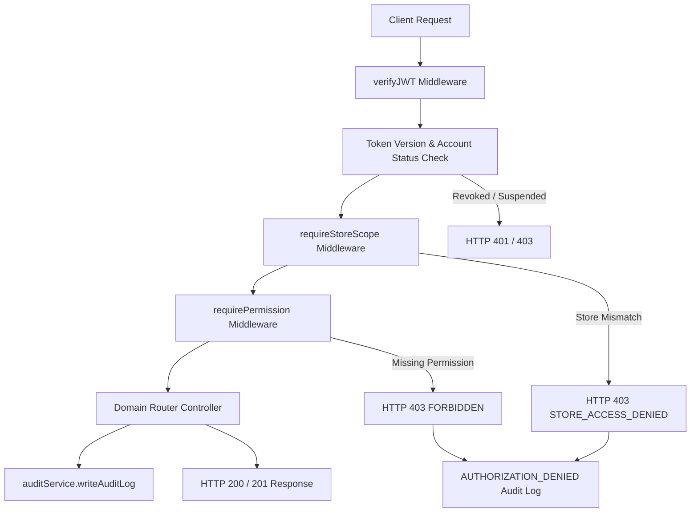

# RBAC & Authorization Architecture

## 1. Overview
The AIAVRO Business OS implements a centralized, defense-in-depth Role-Based Access Control (RBAC) and Scope-Based Access Control (SBAC) architecture. All authorization decisions are strictly enforced server-side.



---

## 2. Core Security Services

### 2.1 Central Authorization Service (`services/authzService.js`)
- **`requirePermission(permission)`**: Verifies that the authenticated actor (`req.user`) possesses the explicit granular permission (or super admin wildcard `*`).
- **`requireAnyPermission(permissionsArray)`**: Evaluates whether the actor has at least one of the required permissions.
- **`requireStoreScope(locationExtractor)`**: Restricts non-global users (`assignedStoreId !== 'all'`) from creating or modifying records belonging to stores other than their assigned outlet.
- **`getStoreScopeFilter(user, fieldNames)`**: Automatically injects store-scoping query filters into MongoDB `find()` queries for read isolation (`GET /invoices`, `GET /purchases`, `GET /inventory`).

### 2.2 Token Revocation & Session Versioning (`tokenVersion`)
- Every user account in the `users` collection maintains an integer `tokenVersion` (default `1`).
- The JWT payload embeds `{ tokenVersion }`.
- On password change or account deactivation, `tokenVersion` is atomically incremented (`$inc: { tokenVersion: 1 }`).
- `verifyJWT` validates the JWT claim against the live user record in MongoDB. If a mismatch is detected, the token is instantly rejected with `401 SESSION_REVOKED`.

---

## 3. Scope Hierarchy

| Scope Level | `assignedStoreId` | Access Level |
|---|---|---|
| **GLOBAL** | `'all'` (Super Admin / Owner) | Unrestricted multi-store reads, cross-store transfers, system configurations, global catalog management. |
| **STORE** | Specific Store ID (e.g. `'store-blr-1'`) | Scoped strictly to the assigned physical outlet. Blocked from viewing or manipulating data from other outlets. |

---

## 4. Error Contract

When authorization fails, the API responds with a standardized, non-leaking JSON error payload:

```json
{
  "success": false,
  "error": {
    "code": "FORBIDDEN",
    "message": "Forbidden: Missing required permission 'invoices.void'"
  },
  "requestId": "req-1786675900000"
}
```

Common error codes:
- `UNAUTHORIZED` (401): Missing or malformed token.
- `TOKEN_EXPIRED` (401): JWT expired.
- `SESSION_REVOKED` (401): Token invalidated by password change or security reset.
- `ACCOUNT_DEACTIVATED` (403): User account is suspended or inactive.
- `FORBIDDEN` (403): Missing required permission.
- `STORE_ACCESS_DENIED` (403): User store does not match target resource store.
