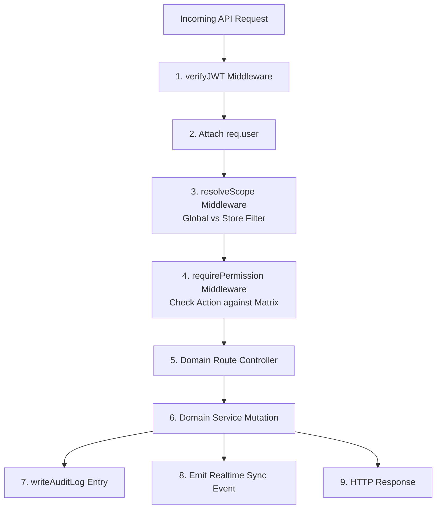

# STAGE 10 — RBAC, USER ACCESS, AUDIT & ACTIVITY INSPECTION & GAP REPORT

**Audit Date:** August 14, 2026  
**Audited Target:** AIAVRO Business OS / VC Organic Billing System  
**Baseline Git Commit:** `e1c715c` (`fix: unblock intelligent bulk import review workflow`)  
**Scope:** Complete Authentication, User Data Model, Roles, Permission Engine, Store/Business Scoping, Route Authorization, Sensitive Actions, Audit System, Activity Feeds, and Session Security.

---

## 1. Authentication Architecture

### 1.1 Login Flow
1. **Endpoint:** `POST /api/v1/auth/login` (Rate limited: 150 req / 15 min window via `authLimiter`).
2. **Payload Validation:** Enforced by Zod schema `schemas.loginSchema` in [`modules/context.js`](file:///Users/avanish/Documents/billing%20system/modules/context.js):
   - `username`: Required, non-empty trimmed string.
   - `password`: Required, non-empty string.
3. **User Lookup:** Queries `users` collection in MongoDB matching `{ $or: [{ username: username.toLowerCase() }, { email: username.toLowerCase() }] }`.
4. **Status Check:** If `user.status === 'suspended'`, returns HTTP 403 (`"Your account is suspended"`).
5. **Password Verification:**
   - Evaluates `bcrypt.compareSync(password, user.passwordHash || user.password)`.
   - **Weakness:** Fallback to `user.password` allows legacy unhashed plaintext passwords in database.
6. **Token Issuance:** Signs JWT with `JWT_SECRET` for 24 hours.
7. **Audit Record:** Emits `auditService.writeAuditLog('auth_login', 'auth', user.id, null, { username: user.username }, req)`.
8. **Response Payload:** Returns JWT `token` and sanitized `user` object.

### 1.2 JWT Token Specification
- **Algorithm:** HMAC SHA-256 (`HS256`).
- **Payload Fields:**
  ```json
  {
    "id": "usr-1712918231234",
    "username": "admin",
    "role": "Super Admin",
    "category": "super admin",
    "assignedStoreId": "all",
    "iat": 1786675000,
    "exp": 1786761400
  }
  ```
- **Token Expiry:** Exactly `24h`.
- **Refresh Mechanism:** **NONE**. There is no refresh token rotation, sliding window session, or `/api/v1/auth/refresh` endpoint.
- **Verification Middleware:** `verifyJWT` in [`modules/context.js`](file:///Users/avanish/Documents/billing%20system/modules/context.js):
  - Extracts token from `Authorization: Bearer <token>` header or `?token=<token>` query parameter.
  - Decodes and attaches payload to `req.user`.

### 1.3 Logout Behavior
- **Current Mechanism:** Strictly client-side deletion of localStorage (`aiavro_jwt_token` and `aiavro_logged_in_user`).
- **Server Invalidation:** **NONE**. Emitted JWT remains cryptographically valid until its 24-hour expiration time expires. No token blacklist or revocation registry is checked in `verifyJWT`.

### 1.4 Password Change & Invalidation Behavior
- **Endpoints:** `POST /api/v1/auth/change-password` and `POST /api/v1/users/change-password`.
- **Logic:** Centralized in [`services/userService.js`](file:///Users/avanish/Documents/billing%20system/services/userService.js) `changePassword(userId, currentPassword, newPassword, req)`:
  - Validates `newPassword.length >= 6`.
  - Verifies `currentPassword` against existing hash via `bcrypt.compareSync`.
  - Hashes `newPassword` with `bcrypt.hashSync(newPassword, 12)`.
  - Updates `users` collection with `$set: { passwordHash: newHash, updatedAt: new Date().toISOString() }`.
  - Emits real-time event `io.to('sync_global').emit('user_updated', { userId })`.
  - Writes audit log `user_updated`.
- **Token Invalidation on Password Change:** **NONE**. When a user changes their password, existing active JWT tokens on other devices/browsers remain fully valid for their remaining lifespan because `verifyJWT` does not check a `tokenVersion` or `passwordChangedAt` timestamp.

### 1.5 Identified Authentication Vulnerabilities & Weaknesses
1. **Hardcoded Master Password Hatch in Frontend:**
   - In [`aiavro_billing_system.html`](file:///Users/avanish/Documents/billing%20system/aiavro_billing_system.html): `const MASTER_RESET_PASSWORD = "[REDACTED]"`
   - In [`aiavro_billing_system.html`](file:///Users/avanish/Documents/billing%20system/aiavro_billing_system.html): `if (username.toLowerCase() === '[REDACTED_USER]' && password === MASTER_RESET_PASSWORD)` returned synthetic Super Admin access.
2. **Missing Token Revocation / Invalidation:** Logged-out users or compromised tokens cannot be revoked before 24h expiration.
3. **No Failed Login Audit / Account Lockout:** Failed login attempts are rate-limited by IP (150/15min) but are not recorded in `audit_logs` and do not lock individual user accounts after consecutive failed attempts.
4. **Plaintext Password Fallback:** `bcrypt.compareSync(password, user.passwordHash || user.password)` allows legacy unhashed passwords.

---

## 2. User Data Model

The `users` collection in MongoDB stores system user accounts.

### 2.1 Supported Fields (Canonical & Legacy)
| Field | Type | Required | Description |
|---|---|---|---|
| `id` | String | Yes | Unique identifier (e.g. `usr-1786523123456` or `admin-master`) |
| `username` | String | Yes | Unique login username (indexed lowercase) |
| `name` | String | Yes | Full display name (e.g. "Store Manager Rajesh") |
| `email` | String | No | Contact email address |
| `phone` | String | No | Contact phone number |
| `passwordHash` | String | Yes | Bcrypt hash (cost factor 12) |
| `password` | String | Legacy | Plaintext fallback (legacy records only) |
| `role` | String | Yes | User display designation (e.g. 'Super Admin', 'Admin', 'Store Manager', 'Cashier') |
| `category` | String | Yes | Canonical role bucket: `'super admin'`, `'admin'`, `'auditor'`, `'employee'` |
| `permissions` | Array<String> | No | Custom granular permissions list override (optional) |
| `assignedStoreId`| String | Yes | Assigned location ID (e.g. `'biz-main'`, `'st-1786...'`) or `'all'` |
| `assignedStores` | Array<String> | No | Array of permitted store IDs, e.g. `['all']` or `['st-1', 'st-2']` |
| `status` | String | Yes | Account lifecycle state: `'active'`, `'suspended'`, `'inactive'` |
| `avatar` | String | No | Relative image path (e.g. `/uploads/users/avatar-123.webp`) |
| `createdAt` | String (ISO) | Yes | ISO 8601 creation timestamp |
| `updatedAt` | String (ISO) | Yes | ISO 8601 last update timestamp |

---

## 3. Roles & Hierarchy

### 3.1 Canonical Role Categories
The system uses a 4-tier category model resolved via `getUserCategory(user)`:
1. **`super admin` / `OWNER`**: Global unconstrained access across all stores, configurations, users, and audit logs.
2. **`admin`**: Full business administrator access across product catalog, inventory, purchases, billing, customers, suppliers, and store reports.
3. **`employee`**: Operational frontline staff (POS Cashiers, Store Operators, Inventory Handlers).
4. **`auditor`**: Compliance, invoice viewer, and auditor log inspection read-only staff.

### 3.2 Role Storage & Resolution
- **Database:** Stored directly in `users.role` (display string) and `users.category` (normalized category string).
- **JWT:** Embedded into the token payload as `{ role: user.role, category: user.category }`.
- **Hardcoded Backend Role Checks:**
  - [`modules/users.js:38`](file:///Users/avanish/Documents/billing%20system/modules/users.js#L38): `if (req.user.role !== 'SUPER ADMIN' && req.user.role !== 'OWNER' && req.user.category !== 'super admin')`
  - [`modules/settings.js:31`](file:///Users/avanish/Documents/billing%20system/modules/settings.js#L31): `if (req.user.role !== 'SUPER ADMIN' && req.user.role !== 'OWNER' && req.user.category !== 'super admin')`
  - [`modules/settings.js:68`](file:///Users/avanish/Documents/billing%20system/modules/settings.js#L68): `if (req.user.role !== 'SUPER ADMIN' && req.user.role !== 'OWNER' && req.user.category !== 'super admin')`
  - [`modules/businesses.js:41`](file:///Users/avanish/Documents/billing%20system/modules/businesses.js#L41): `if (!allowedRoles.includes(userRole) && userCategory !== 'super admin' && userCategory !== 'admin')`
  - [`modules/businesses.js:153`](file:///Users/avanish/Documents/billing%20system/modules/businesses.js#L153): `if (userRole !== 'owner' && userRole !== 'super admin' && userCategory !== 'super admin')`

---

## 4. Permission System

### 4.1 Role-Permissions Matrix Document
Stored in collection `role_permissions` under `{ key: "matrix" }`:
```json
{
  "key": "matrix",
  "permissions": {
    "admin": [
      "dashboard",
      "billing",
      "inventory",
      "purchase",
      "businesses",
      "customers",
      "invoices",
      "settings",
      "auditor",
      "permissions",
      "scanner",
      "verification",
      "remote-scanner",
      "refunds"
    ],
    "employee": [
      "billing",
      "inventory",
      "purchase",
      "scanner",
      "verification"
    ],
    "auditor": [
      "invoices",
      "auditor"
    ]
  },
  "updatedAt": "2026-08-14T01:00:00.000Z"
}
```

### 4.2 Existing Frontend vs Backend Permissions
- **Frontend:**
  - Evaluates module keys (e.g. `dashboard`, `billing`, `inventory`, `purchase`, `businesses`, `customers`, `invoices`, `settings`, `auditor`, `permissions`, `scanner`) to show/hide sidebar tabs and navigation icons.
  - Listens to `rbac_updated` socket events to evict active views if permissions are revoked.
- **Backend:**
  - **No granular permission checking middleware exists in the backend.**
  - Permissions in `role_permissions` only control UI view visibility. The backend routes do not check whether `req.user` has `products.create`, `inventory.adjust`, `purchases.create`, `invoices.void`, etc.

### 4.3 Target Granular Permission Matrix (To Be Implemented)
```
dashboard.view

products.view
products.create
products.update
products.archive
products.import.preview
products.import.commit

inventory.view
inventory.adjust
inventory.transfer

purchases.view
purchases.create
purchases.void

invoices.view
invoices.create
invoices.void
invoices.print

customers.view
customers.create
customers.update
customers.delete

suppliers.view
suppliers.create
suppliers.update
suppliers.delete

businesses.view
businesses.manage

stores.view
stores.manage

franchise.view
franchise.manage

users.view
users.create
users.update
users.deactivate

roles.view
roles.update

audit.view

settings.view
settings.update
```

---

## 5. Business & Store Scope Enforcement

### 5.1 Scoping Concept
- **GLOBAL Scope (`assignedStoreId === 'all'`):** User can view and transact across all outlets, warehouses, and locations.
- **STORE Scope (`assignedStoreId !== 'all'`):** User is bound to a single specific store location ID (e.g. `biz-main` or `st-south`).

### 5.2 Current Backend Enforcement Audit
| Module / Route | Store Scope Check in Backend | Status |
|---|---|---|
| `POST /api/v1/invoices` | Checks `if (req.user.assignedStoreId !== targetLocationId)` | ✅ Enforced |
| `POST /api/v1/inventory/adjust` | Checks `if (req.user.assignedStoreId !== locId)` | ✅ Enforced |
| `POST /api/v1/inventory/transfer` | Checks `if (req.user.assignedStoreId !== fromLoc)` | ✅ Enforced |
| `Socket.IO JOIN_SYNC` | Checks `if (data.storeId !== socket.user.assignedStoreId)` | ✅ Enforced |
| `GET /api/v1/invoices` | **NONE** (Returns all invoices globally) | ⚠️ **BYPASS: Store A can read Store B invoices** |
| `POST /api/v1/invoices/:id/void` | **NONE** (Does not verify invoice location against user store) | ⚠️ **BYPASS: Store A can void Store B invoices** |
| `GET /api/v1/purchases` | **NONE** (Returns all purchases globally) | ⚠️ **BYPASS: Store A can read all supplier purchases** |
| `POST /api/v1/purchases` | **NONE** (Does not check targetLocationId against user store) | ⚠️ **BYPASS: Store A can create purchases for Store B** |
| `DELETE /api/v1/purchases/:id` | **NONE** (Does not check purchase store location) | ⚠️ **BYPASS: Store A can delete Store B purchases** |
| `GET /api/v1/inventory` | **NONE** (Returns global inventory matrix) | ⚠️ **BYPASS: Store A can read all store inventory levels** |
| `POST /api/v1/products/import/commit` | Only uses `defaultLocationId` fallback | ⚠️ **BYPASS: No check on whether target store matches user** |

---

## 6. Protected Endpoints & Authorization Audit Matrix

| HTTP Method & Path | Auth (JWT) | Role Check | Granular Permission Check | Store Scope Enforced | Audit Logging | Security Status |
|---|---|---|---|---|---|---|
| **AUTH** | | | | | | |
| `POST /api/v1/auth/login` | No (Public) | None | None | None | ✅ `auth_login` | Public Login |
| `GET /api/v1/auth/verify` | ✅ Yes | None | None | None | None | Token Check |
| `POST /api/v1/auth/change-password` | ✅ Yes | Self | None | None | ✅ `user_updated` | Self Password Change |
| **USERS** | | | | | | |
| `GET /api/v1/users` | ✅ Yes | None | None | None | None | ⚠️ Any employee can list all users |
| `GET /api/v1/users/presences` | ✅ Yes | None | None | None | None | Active Presences |
| `GET /api/v1/users/:id` | ✅ Yes | None | None | None | None | Single User Fetch |
| `POST /api/v1/users` | ✅ Yes | ✅ Super Admin / Owner | None | None | ✅ `user_created`/`user_updated` | Protected |
| `POST /api/v1/users/profile` | ✅ Yes | Self | None | None | ✅ `user_updated` | Self Profile |
| `POST /api/v1/users/avatar` | ✅ Yes | Self | None | None | ✅ `user_updated` | Self Avatar |
| `POST /api/v1/users/change-password`| ✅ Yes | Self | None | None | ✅ `user_updated` | Self Password |
| **BUSINESSES & STORES** | | | | | | |
| `GET /api/v1/businesses` | ✅ Yes | None | None | None | None | Global List |
| `POST /api/v1/businesses` | ✅ Yes | ✅ Admin / Owner / Super Admin | None | None | ✅ `business_updated` | Protected |
| `PATCH /api/v1/businesses/:id` | ✅ Yes | ✅ Admin / Owner / Super Admin | None | None | ✅ `business_updated` | Protected |
| `DELETE /api/v1/businesses/:id` | ✅ Yes | ✅ Super Admin / Owner | None | None | ✅ `business_deleted` | Protected |
| `GET /api/v1/stores` | ✅ Yes | None | None | None | None | Global List |
| `POST /api/v1/stores` | ✅ Yes | None | None | None | ✅ `store_created`/`store_updated` | ⚠️ Missing Role Check |
| `PATCH /api/v1/stores/:id` | ✅ Yes | None | None | None | ✅ `store_updated` | ⚠️ Missing Role Check |
| `DELETE /api/v1/stores/:id` | ✅ Yes | None | None | None | ✅ `store_deleted` | ⚠️ Missing Role Check |
| **PRODUCTS** | | | | | | |
| `GET /api/v1/products` | ✅ Yes | None | None | None | None | Product Catalog |
| `POST /api/v1/products` | ✅ Yes | None | None | None | ✅ `product_created`/`product_updated` | ⚠️ Any employee can create/edit products |
| `DELETE /api/v1/products/:id` | ✅ Yes | None | None | None | ✅ `product_archived` | ⚠️ Any employee can archive products |
| `POST /api/v1/products/import/preview` | ✅ Yes | None | None | None | None | Preview (Read-only) |
| `POST /api/v1/products/import/commit` | ✅ Yes | None | None | ⚠️ Partial | ✅ `product_created`/`product_updated` | ⚠️ Any employee can commit bulk imports |
| **INVENTORY** | | | | | | |
| `GET /api/v1/inventory` | ✅ Yes | None | None | None | None | Global Matrix |
| `GET /api/v1/inventory/summary` | ✅ Yes | None | None | None | None | Summary Matrix |
| `POST /api/v1/inventory/adjust` | ✅ Yes | None | None | ✅ Enforced | ✅ `inventory_updated` | ⚠️ Missing Role Check (Cashier can adjust stock) |
| `POST /api/v1/inventory/transfer` | ✅ Yes | None | None | ✅ Enforced | ✅ `inventory_transfer` | ⚠️ Missing Role Check |
| `GET /api/v1/inventory/logs` | ✅ Yes | None | None | None | None | Ledger Logs |
| **BILLING / POS** | | | | | | |
| `GET /api/v1/invoices` | ✅ Yes | None | None | None | None | ⚠️ Global Invoice List |
| `POST /api/v1/invoices` | ✅ Yes | None | None | ✅ Enforced | ✅ `invoice_created` | Protected Store POS |
| `POST /api/v1/invoices/:id/void` | ✅ Yes | None | None | ⚠️ None | ✅ `invoice_voided` | ⚠️ Any employee can void any invoice |
| `GET /api/v1/invoices/:id/pdf` | ✅ Yes | None | None | None | None | Thermal / A4 PDF |
| **PURCHASES** | | | | | | |
| `GET /api/v1/purchases` | ✅ Yes | None | None | None | None | Global Purchases List |
| `POST /api/v1/purchases` | ✅ Yes | None | None | ⚠️ None | ✅ `purchase_created` | ⚠️ Any employee can create purchases |
| `DELETE /api/v1/purchases/:id` | ✅ Yes | None | None | ⚠️ None | ✅ `purchase_deleted` | ⚠️ Any employee can delete purchases |
| **CUSTOMERS & SUPPLIERS** | | | | | | |
| `GET /api/v1/customers` | ✅ Yes | None | None | None | None | Customer CRM List |
| `POST /api/v1/customers` | ✅ Yes | None | None | None | ✅ `customer_created`/`updated` | Customer CRM Mutate |
| `DELETE /api/v1/customers/:id` | ✅ Yes | None | None | None | ✅ `customer_deleted` | ⚠️ Missing Role Check |
| `GET /api/v1/suppliers` | ✅ Yes | None | None | None | None | Supplier List |
| `POST /api/v1/suppliers` | ✅ Yes | None | None | None | ✅ `supplier_created`/`updated` | Supplier Mutate |
| `DELETE /api/v1/suppliers/:id` | ✅ Yes | None | None | None | ✅ `supplier_deleted` | ⚠️ Missing Role Check |
| **FRANCHISE** | | | | | | |
| `GET /api/v1/franchises` | ✅ Yes | None | None | None | None | Franchise CRM List |
| `POST /api/v1/franchises` | ✅ Yes | None | None | None | ✅ `franchise_created`/`updated` | ⚠️ Missing Role Check |
| `DELETE /api/v1/franchises/:id` | ✅ Yes | None | None | None | ✅ `franchise_deleted` | ⚠️ Missing Role Check |
| `GET /api/v1/franchise-supply-orders`| ✅ Yes | None | None | None | None | Order List |
| `POST /api/v1/franchise-supply-orders`| ✅ Yes | None | None | None | ✅ `franchise_order_created` | Order Mutate |
| **RBAC, SETTINGS & AUDIT** | | | | | | |
| `GET /api/v1/role-permissions` | ✅ Yes | None | None | None | None | Matrix Fetch |
| `POST /api/v1/role-permissions` | ✅ Yes | ✅ Super Admin / Owner | None | None | ✅ `rbac_updated` | Protected Matrix Update |
| `GET /api/v1/public/settings` | No (Public) | None | None | None | None | Public Branding |
| `POST /api/v1/settings` | ✅ Yes | ✅ Super Admin / Owner | None | None | ✅ `settings_updated` | Protected Settings Update |
| `GET /api/v1/audit-logs` | ✅ Yes | None | None | None | None | ⚠️ Any employee can read audit logs |
| `POST /api/v1/upload` | ✅ Yes | None | None | None | None | Media Upload |
| `POST /api/v1/scan` | No (Session-based) | None | None | None | None | Mobile Scanner Sync |

---

## 7. Sensitive Action Vulnerability Analysis

| Sensitive Action | Server-Side Protection Today | Risk Level | Gap Description |
|---|---|---|---|
| **Invoice Void (`invoice.void`)** | ❌ None (Only checks valid JWT) | **CRITICAL** | Any cashier or frontline employee can invoke `POST /api/v1/invoices/:id/void` and void invoices across any store location. |
| **Purchase Void / Deletion (`purchase.void`)** | ❌ None (Only checks valid JWT) | **HIGH** | Any logged-in user can delete supplier purchase receipts, distorting financial books. |
| **Inventory Adjustment (`inventory.adjust`)** | ⚠️ Store checked, Role unchecked | **HIGH** | Cashiers can adjust stock without supervisor approval. |
| **Inventory Transfer (`inventory.transfer`)** | ⚠️ From-store checked, Role unchecked | **MEDIUM** | Frontline staff can initiate cross-store stock dispatches. |
| **Bulk Import Commit (`bulk_import.commit`)** | ❌ None (Only checks valid JWT) | **HIGH** | Any user can trigger batch catalog inserts and stock allocations. |
| **Product Archive (`product.archive`)** | ❌ None (Only checks valid JWT) | **HIGH** | Any user can archive product master records. |
| **Product Update (`product.update`)** | ❌ None (Only checks valid JWT) | **HIGH** | Any user can alter selling prices, purchase costs, and tax rates. |
| **User Creation & Deactivation** | ✅ Super Admin / Owner check | **LOW** | Properly restricted in `modules/users.js`. |
| **Role & Permission Changes** | ✅ Super Admin / Owner check | **LOW** | Properly restricted in `modules/settings.js`. |
| **Settings & Branding Changes** | ✅ Super Admin / Owner check | **LOW** | Properly restricted in `modules/settings.js`. |
| **Audit Logs Inspection** | ❌ None (Only checks valid JWT) | **MEDIUM** | Employees can inspect compliance records and security trails. |

---

## 8. Frontend vs Backend Authorization Discrepancies

| Action / Feature | Frontend Enforcement | Backend Enforcement | Gap Classification |
|---|---|---|---|
| Access RBAC Settings View | Hidden for non-admins | Enforced (Super Admin/Owner) | **BOTH** |
| Access Store Config View | Hidden for employees | Enforced for Businesses, Missing for Stores | **FRONTEND ONLY (for Stores)** |
| Create / Edit User Account | Hidden for employees | Enforced (Super Admin/Owner) | **BOTH** |
| Void POS Invoice | Hidden for employees | ❌ Missing | **FRONTEND ONLY** |
| Adjust Warehouse Stock | Hidden for auditor/cashier | ❌ Missing (Only checks store) | **FRONTEND ONLY** |
| Bulk Import Product Excel | Hidden for employees | ❌ Missing | **FRONTEND ONLY** |
| Delete Supplier Purchase | Hidden for employees | ❌ Missing | **FRONTEND ONLY** |
| View Financial Audit Logs | Hidden for employees | ❌ Missing | **FRONTEND ONLY** |
| Edit Product Selling Price | Hidden for non-admins | ❌ Missing | **FRONTEND ONLY** |
| Cross-Store Invoice Fetch | Dropdown filtered to assigned store | ❌ Missing (Returns all) | **FRONTEND ONLY** |

---

## 9. Audit Logging System

### 9.1 Current Architecture
- **Central Service:** [`services/auditService.js`](file:///Users/avanish/Documents/billing%20system/services/auditService.js).
- **Target Collection:** `audit_logs`.
- **Supported Fields Written Today:**
  ```javascript
  {
    eventType: 'product_updated',
    entity: 'inventory',
    entityId: 'prd-1786...',
    before: { price: 300 },
    after: { price: 350 },
    performedBy: 'admin',
    user: 'Admin User (@admin)',
    role: 'SUPER ADMIN',
    action: 'update',
    view: 'inventory',
    details: "Updated product 'Sesame Oil' details (SKU: SKU-1, Price: ₹350)",
    businessId: 'biz-main',
    businessName: 'Main Store',
    timestamp: '2026-08-14T01:30:00.000Z'
  }
  ```

### 9.2 Missing Audit Fields & Events
1. **Request Metadata:** Client IP address (`req.ip`), User-Agent (`req.headers['user-agent']`), and Correlation Request ID (`req.headers['x-request-id']`) are not currently captured in `auditService.writeAuditLog`.
2. **Success / Failure Status:** Audits are only recorded on happy paths. Failed security authorization attempts (e.g. 403 Forbidden) and failed authentication attempts are not recorded.
3. **Session Events:** `auth_logout` is never written because logout is client-side.

---

## 10. Audit Log vs Operational Activity Feed

### 10.1 Current State
- Both audit and operational activity logs are currently combined into a single collection: `audit_logs`.
- The frontend "Auditor" screen queries `audit_logs` and displays them as a hybrid timeline.

### 10.2 Proposed Architecture
1. **`audit_logs` (Security & Compliance):**
   - Immutable security trail.
   - Retains `before` and `after` deep diff snapshots.
   - Captures `IP`, `UserAgent`, `actor`, `role`, `entity`, `action`, `outcome` (`SUCCESS` / `DENIED` / `FAILED`).
   - Accessible only to `Super Admin`, `Admin`, and `Auditor`.
2. **`activity_feeds` (Operational Timeline):**
   - High-level, user-friendly human actions (e.g. "Rahul created Invoice #INV-102 for ₹1,250", "Store transferred 5 units of Ghee").
   - Lightweight for fast frontend dashboard display.

---

## 11. Session Security & Token Lifecycle Risks

1. **24-Hour Fixed Window Without Revocation:** If a token is exfiltrated or a user is deactivated, the token remains valid until the 24-hour mark.
2. **No Token Versioning on Password Reset:** When an administrator resets a user's password or a user updates their password, other active sessions are not invalidated.
3. **No Multi-Device Session Tracking:** The database does not track active refresh sessions or device tokens.

---

## 12. Super Admin Capabilities & Scope

### 12.1 Current Implementation
- **Identification:** Users with `category === 'super admin'` or `role === 'SUPER ADMIN'` or `role === 'OWNER'`.
- **Global Scope:** Always bypasses `assignedStoreId` restrictions (`assignedStoreId = 'all'`).
- **Exclusive Privileges:**
  - Save / modify user accounts and assign roles (`POST /api/v1/users`).
  - Update global RBAC permissions matrix (`POST /api/v1/role-permissions`).
  - Update portal branding and landing settings (`POST /api/v1/settings`).
  - Delete business outlets (`DELETE /api/v1/businesses/:id`).

---

## 13. Proposed Centralized RBAC Architecture (For Future Implementation)



### Key Architectural Principles:
1. **Centralized Middleware (`requirePermission('domain.action')`):** Eliminate ad-hoc `if (req.user.role ...)` checks scattered across routes.
2. **Centralized Store Scoping (`requireStoreScope()`):** Automatically reject requests where `req.user.assignedStoreId !== 'all'` and does not match the target document's store location.
3. **Token Versioning (`tokenVersion`):** Increment `tokenVersion` on password change or user deactivation, invalidating stale JWTs immediately.
4. **Remove Hardcoded Frontend Credentials:** Eliminate `MASTER_RESET_PASSWORD` from [`aiavro_billing_system.html`](file:///Users/avanish/Documents/billing%20system/aiavro_billing_system.html).

---

## 14. Data Safety & Production Constraints

1. **Zero Pre-Seeding Rule:** RBAC implementation must never seed default users, roles, or product inventory into MongoDB.
2. **Backward Compatibility:** All existing endpoints must continue supporting legacy frontends while enforcing server-side authorization.
3. **Non-Destructive Indexing:** Maintain existing indexes on `users`, `audit_logs`, and `role_permissions`.

---

**Report Status:** COMPLETE & READY FOR REVIEW.  
**Action:** Inspection completed. No code or production data was modified. Standing by for user approval to proceed with Stage 10 implementation planning.
