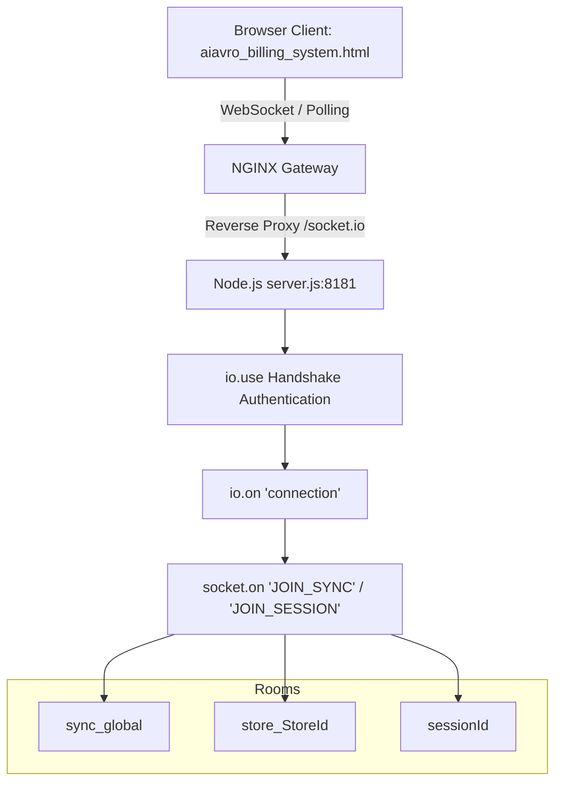
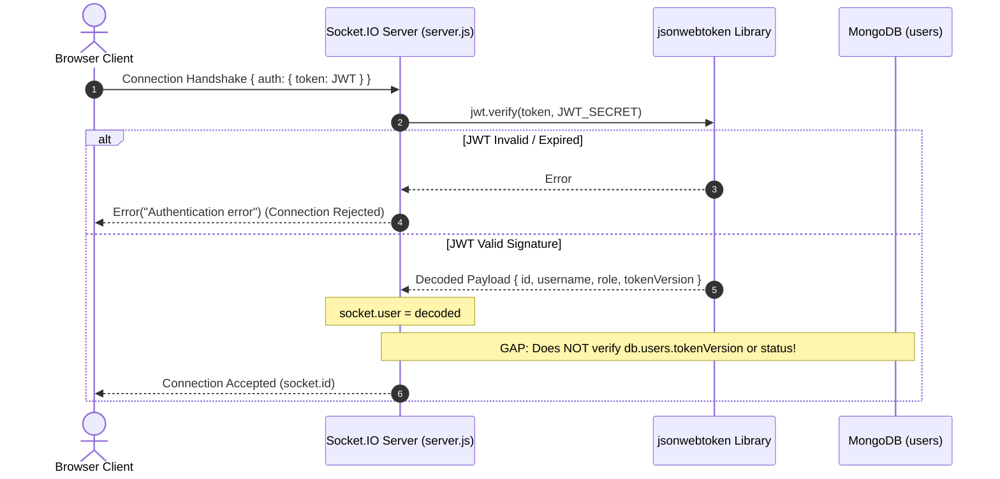
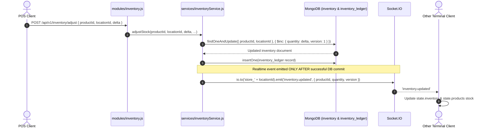
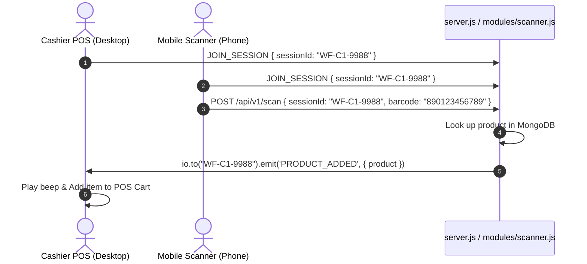
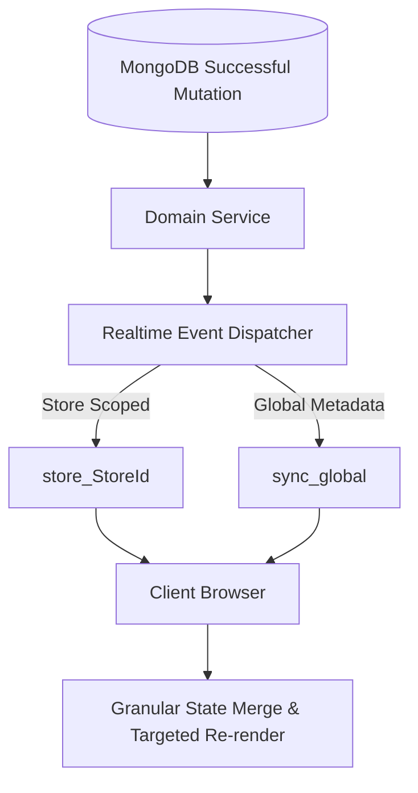

# Stage 11: Realtime Architecture & Synchronization Inspection Report

**Date:** August 14, 2026  
**Status:** Complete Architecture Inspection & Gap Analysis  
**Mode:** Inspection Only (No code or production data modified)

---

## 1. Current Socket Architecture

The realtime subsystem is built on Socket.IO v4.7.5 integrated into the primary Express/HTTP server (`server.js`).

### Key Components:
- **Server Initialization:** `server.js` lines 68-74 initializes `const io = socketIo(server, { cors: { origin: "*", methods: ["GET", "POST"] } });`.
- **Global Context Injection:** `modules/context.js` distributes `io` to all domain routers and domain services via `setupContext(db, io, JWT_SECRET, ...)`.
- **Frontend Clients:**
  1. `syncSocket`: Primary background data synchronization socket (`aiavro_billing_system.html:6294-6508`).
  2. `desktopSocket`: POS barcode pairing socket (`aiavro_billing_system.html:12389-12423`).
  3. `phoneSocket`: Mobile camera barcode scanner socket (`aiavro_billing_system.html:12480-12512`).

---

## 2. Socket Authentication

### Findings & Identified Gaps:
1. **Missing Session Revocation Check:** `io.use` in `server.js:81-89` validates the JWT cryptographic signature and expiration, but **does not query MongoDB** for `user.tokenVersion` or `user.status === 'suspended'`. When a user's password is changed or account is suspended, existing socket connections remain connected until token expiration.
2. **Missing Token on Scanner Sockets:** `desktopSocket` and `phoneSocket` in `aiavro_billing_system.html:12393` and `:12485` call `io(state.backendUrl)` **without** passing `{ auth: { token } }`.

---

## 3. Room Architecture

| Room Name | Scope | Membership Rule | Enforced By | Events Emitted to Room |
|---|---|---|---|---|
| `sync_global` | Global | All authenticated connections | `server.js:111` | `product_updated`, `product_deleted`, `products_imported`, `import_completed`, `purchase_created`, `purchase_deleted`, `customer_updated`, `customer_deleted`, `supplier_updated`, `supplier_deleted`, `business_updated`, `business_deleted`, `store_updated`, `store_deleted`, `franchise_updated`, `franchise_deleted`, `franchise_order_created`, `user_updated`, `rbac_updated`, `settings_updated` |
| `store_<storeId>` | Store Outlet | User `assignedStoreId === 'all'` or matching `storeId` | `server.js:104-114` | `inventory.updated`, `invoice_created`, `invoice_voided`, `purchase_created` |
| `<sessionId>` | Scanner Pairing | Ephemeral session token (e.g. `WF-C1-XXXX`) | `server.js:94-98` | `PRODUCT_ADDED`, `PRODUCT_NOT_FOUND` |

---

## 4. Multi-Tenant & Store Isolation Analysis

1. **Store Isolation for Inventory and Invoices:**
   - `inventory.updated` is scoped strictly to `store_<storeId>`. Store A users do not receive Store B inventory stock adjustments.
   - `invoice_created` and `invoice_voided` are emitted strictly to `store_<locationId>`.
2. **Global Leakage Gaps:**
   - **`purchase_created` Duplicate Emission:** `modules/purchases.js:162-163` emits `purchase_created` to `store_<locationId>` **AND** `sync_global`. Consequently, Store A users receive supplier purchase orders belonging to Store B.
   - **Customer & Supplier Directory Updates:** `customer_updated` and `supplier_updated` are broadcast globally to `sync_global`.

---

## 5. Comprehensive Socket Event Inventory

| Event Name | Emitter | Source Module | Room | Payload Summary | Purpose | Consumer |
|---|---|---|---|---|---|---|
| `inventory.updated` | `inventoryService.js:106, 170` | `services/inventoryService.js` | `store_<storeId>` | `{ eventId, productId, locationId, storeId, quantity, version, timestamp }` | Realtime stock level sync | POS & Inventory tables |
| `invoice_created` | `billing.js:206` | `modules/billing.js` | `store_<storeId>` | `{ invoiceNumber, locationId }` | Notify POS invoice completion | Invoices table |
| `invoice_voided` | `billing.js:319` | `modules/billing.js` | `store_<storeId>` | `{ invoiceId }` | Notify POS invoice voiding | Invoices table |
| `purchase_created` | `purchases.js:162-163` | `modules/purchases.js` | `store_<storeId>` & `sync_global` | `{ purchase: purchaseDoc }` | Notify purchase bill recording | Purchase table |
| `purchase_deleted` | `purchases.js:265` | `modules/purchases.js` | `sync_global` | `{ purchaseId }` | Notify purchase bill voiding | Purchase table |
| `product_updated` | `products.js:395` | `modules/products.js` | `sync_global` | `{ productId }` | Product catalog update | POS & Product table |
| `product_deleted` | `products.js:425` | `modules/products.js` | `sync_global` | `{ productId }` | Product archiving | Product table |
| `products_imported` | `bulkImportService.js:1001` | `services/bulkImportService.js` | `sync_global` | `{ importId, count }` | Notify bulk import completed | Product table |
| `import_completed` | `bulkImportService.js:1002` | `services/bulkImportService.js` | `sync_global` | `{ importId, summary }` | Notify bulk import summary | Audit / Import UI |
| `customer_updated` | `customers.js:55, 81` | `modules/customers.js` | `sync_global` | `{ customer: custDoc }` | Customer record sync | Customer table |
| `customer_deleted` | `customers.js:98` | `modules/customers.js` | `sync_global` | `{ id: custId }` | Customer deletion sync | Customer table |
| `supplier_updated` | `suppliers.js:55, 81` | `modules/suppliers.js` | `sync_global` | `{ supplier: supDoc }` | Supplier record sync | Supplier dropdowns |
| `supplier_deleted` | `suppliers.js:98` | `modules/suppliers.js` | `sync_global` | `{ id: supId }` | Supplier deletion sync | Supplier dropdowns |
| `business_updated` | `businesses.js:85, 124` | `modules/businesses.js` | `sync_global` | `{ business: bizDoc }` | Business profile update | Header & Settings |
| `business_deleted` | `businesses.js:140` | `modules/businesses.js` | `sync_global` | `{ id: bizId }` | Business deletion | Store switcher |
| `store_updated` | `stores.js:57, 83` | `modules/stores.js` | `sync_global` | `{ store: storeDoc }` | Store profile update | Store switcher |
| `store_deleted` | `stores.js:100` | `modules/stores.js` | `sync_global` | `{ id: storeId }` | Store deletion | Store switcher |
| `user_updated` | `userService.js:57, 126, 154...` | `services/userService.js` | `sync_global` | `{ user: userDoc }` / `{ userId }` | Staff/profile update | Users table |
| `rbac_updated` | `settings.js:40` | `modules/settings.js` | `sync_global` | `permissions` (matrix object) | Live role permissions update | Nav & view eviction |
| `settings_updated` | `settings.js:74` | `modules/settings.js` | `sync_global` | `{ title, logo }` | Portal branding sync | Header / Logo |
| `franchise_updated`| `franchise.js:52` | `modules/franchise.js` | `sync_global` | `{ franchise: franchiseDoc }` | Franchise profile sync | Franchise table |
| `franchise_deleted`| `franchise.js:68` | `modules/franchise.js` | `sync_global` | `{ id }` | Franchise deletion | Franchise table |
| `franchise_order_created`| `franchise.js:97` | `modules/franchise.js` | `sync_global` | `{ order: orderDoc }` | Franchise order sync | Franchise orders |
| `PRODUCT_ADDED` | `scanner.js:42` | `modules/scanner.js` | `<sessionId>` | `{ product: productDoc }` | Remote barcode scan matched | POS Cart |
| `PRODUCT_NOT_FOUND` | `scanner.js:45` | `modules/scanner.js` | `<sessionId>` | `{ barcode }` | Remote barcode scan unmatched | POS Cart alert |

---

## 6. Event Payload Size & Structure

### Granular Minimal Payloads (Good Practice):
- `inventory.updated`: Emits only `{ eventId, productId, locationId, storeId, quantity, version, timestamp }` (150 bytes).
- `invoice_voided`: Emits `{ invoiceId }` (45 bytes).
- `product_updated`: Emits `{ productId }` (40 bytes).

### Heavy Full-Entity Payloads:
- `purchase_created`: Emits full `purchaseDoc` with complete line item arrays and calculations (2–5 KB).
- `business_updated`: Emits entire business config object with bank details and base64 strings (1–10 KB).

---

## 7. REST vs Realtime Relationship & State Synchronization

When mutations occur, the system exhibits a dual sync behavior:
1. **REST Request Response:** The client initiating the action receives the authoritative updated entity in the HTTP response.
2. **Socket Broadcast:** Other clients listening on the socket receive a notification event.
3. **Heavy `syncStateWithServer()` Re-fetch:** In `aiavro_billing_system.html`, almost every mutation trigger initiates a full `syncStateWithServer()`, issuing **14 sequential REST API requests** (`api.products.list()`, `api.inventory.list()`, `api.invoices.list()`, etc.) and completely replacing in-memory arrays.

---

## 8. Inventory Realtime Flow

**Consistency Verification:** Socket events are **strictly emitted after** successful database mutations. If a database transaction or operation fails, no socket event is emitted.

---

## 9. POS & Invoice Realtime Flow

1. **POS Sale Creation (`POST /api/v1/invoices`):**
   - Stock is deducted in `inventory` and recorded in `inventory_ledger`.
   - Invoice is inserted into `invoices`.
   - `inventory.updated` is emitted per line item to `store_<locationId>`.
   - `invoice_created` is emitted to `store_<locationId>`.
2. **POS Invoice Void (`POST /api/v1/invoices/:id/void`):**
   - Invoice status is set to `VOIDED`.
   - Stock is reverted via `inventoryService.recordMovement` with type `STOCK_VOID`.
   - `inventory.updated` is emitted per reverted item.
   - `invoice_voided` is emitted.

---

## 10. Purchase Realtime Flow

1. **Purchase Receipt (`POST /api/v1/purchases`):**
   - Purchase document is inserted into `purchases`.
   - Stock is added via `inventoryService.recordMovement` with type `PURCHASE_RECEIPT`.
   - `inventory.updated` is emitted to `store_<locationId>`.
   - `purchase_created` is emitted to both `store_<locationId>` and `sync_global`.

---

## 11. Inter-Store Stock Transfer Realtime Flow

1. **Stock Transfer (`POST /api/v1/inventory/transfer`):**
   - Step 1: Deduct from source store $\rightarrow$ `inventory.updated` emitted to `store_<fromLocationId>`.
   - Step 2: Add to destination store $\rightarrow$ `inventory.updated` emitted to `store_<toLocationId>`.
   - Step 3: Source store terminal updates its stock down; destination terminal updates its stock up.

---

## 12. Bulk Import Realtime Flow

In `services/bulkImportService.js:commitImport()`:
- 100 rows with opening stock $\rightarrow$ 100 sequential `inventory.updated` events to `store_<locationId>` + 1 `products_imported` + 1 `import_completed`.
- **Event Storm Risk:** Importing 1,000 products with stock currently triggers **1,000 discrete socket events**. Batching opening stock events into a single summary event will prevent client socket saturation.

---

## 13. Duplicate Socket Connections

1. **Logout Memory Leak:** In `triggerLogout()`, `syncSocket` is **not disconnected** (`syncSocket.disconnect()` is missing) and remains open in the background with the old user's JWT credentials.
2. **Multiple Re-initializations:** When logging in after a logout, `initSyncSocket()` sees `if (syncSocket) return;` and skips re-connecting with the new token.
3. **Scanner Sockets:** POS desktop pairing initiates a secondary `desktopSocket`, creating 2 concurrent socket connections from the same browser tab.

---

## 14. Duplicate Event Listeners

In `aiavro_billing_system.html:6340-6508`, listeners (`syncSocket.on('inventory.updated', ...)`, etc.) are attached inside `initSyncSocket()`. Because `syncSocket` is preserved across the session, listeners are not currently multiplied, but missing `socket.off()` or cleanup guards pose a risk during view switching.

---

## 15. Reconnect & Network Resiliency Behavior

- Socket.IO client is configured with `reconnectionAttempts: 5`, `timeout: 5000`, `transports: ['websocket', 'polling']`.
- On reconnect: `syncSocket.on('connect')` re-triggers `joinStoreSyncRoom()`.
- **JWT Expiry during Reconnect:** If the JWT expires while disconnected, reconnection fails with `connect_error: "Authentication error"`. The client logs a non-fatal warning and falls back cleanly to REST.

---

## 16. Multi-Tab Behavior

- Each browser tab maintains an independent Socket.IO connection.
- When Tab A creates an invoice, Tab B receives `inventory.updated` and `invoice_created`, updating Tab B's local state.

---

## 17. REST & Socket Race Conditions

- **Race Scenario:** When client executes POS checkout, client initiates REST `syncStateWithServer()` while Socket.IO emits `inventory.updated`.
- **Current Mitigation:** `inventory.updated` uses payload `quantity` directly. `syncStateWithServer()` re-fetches authoritative DB stock.

---

## 18. Event Ordering & Idempotency

- `inventory.updated` includes `version: doc.version` and `timestamp`.
- The frontend currently sets `inv.quantity = data.quantity` without verifying if incoming `version` is newer than existing state.
- **Target Improvement:** Compare `version` or `timestamp` before overwriting local state.

---

## 19. Scanner Realtime Flow

---

## 20. Realtime Authorization Model

1. `JOIN_SYNC` verifies that non-super-admin users only join their assigned store room (`store_<assignedStoreId>`).
2. Handshake `io.use` requires a valid JWT token.
3. **Security Gap:** Handshake must validate `tokenVersion` and `status !== 'suspended'` against MongoDB to evict deactivated sessions immediately.

---

## 21. Realtime Security Audit Logging

- `server.js` logs connection/disconnect to server console.
- **Gap:** Room join rejections (`Unauthorized room join attempt`) are logged to stdout but not persisted to `audit_logs` collection as `AUTHORIZATION_DENIED`.

---

## 22. Performance & Event Volume Analysis

| Operation | Scale | Socket Events Generated | Risk / Impact |
|---|---|---|---|
| POS Sale (3 items) | Single transaction | 3 `inventory.updated` + 1 `invoice_created` (4 events) | Low |
| Purchase (10 items) | Single transaction | 10 `inventory.updated` + 2 `purchase_created` (12 events) | Low |
| Bulk Import (5,000 items) | Batch commit | 5,000 `inventory.updated` + 2 summary events | **HIGH (Event Storm)** |

---

## 23. Failure Semantics & REST Fallback

- **Guarantee:** Socket delivery is **best-effort (at-most-once)**.
- **Resilience:** If WebSocket fails or server disconnects, **all POS, billing, inventory, and management features continue to work 100% via REST API calls**.

---

## 24. Observability & Logging

- Current server logs:
  - `[Socket] Client connected: <socket.id>`
  - `[Socket] Client <socket.id> joined sync rooms: sync_global, store_<storeId>`
  - `[Socket] Client disconnected: <socket.id>`
- Zero credentials or tokens are printed to logs.

---

## 25. UI Flicker & Re-render Impact

- `syncStateWithServer()` currently executes 14 REST queries and full table DOM reconstructions.
- Targeted socket handlers (`handleInventoryUpdated`) directly update `inv.quantity` and re-render only the affected grid, preventing UI flicker.

---

## 26. Proposed Target Architecture (Minimal & Lightweight)

### Planned Improvements for Stage 11 Implementation:
1. **Socket Handshake Hardening:** Verify `tokenVersion` and account status against MongoDB in `io.use`.
2. **Disconnect on Logout:** Add `syncSocket.disconnect()` in `triggerLogout()`.
3. **Payload Contract Synchronization:** Align backend emit payloads with frontend listener expectations (`invoice.created`, `product.updated`).
4. **Remove Global Purchase Broadcast:** Restrict `purchase_created` to `store_<locationId>`.
5. **Bulk Import Event Batching:** Emit single batch event `inventory.batch_updated` for large imports.
6. **Audit Room Join Denials:** Persist unauthorized room join attempts to `audit_logs`.

---

## 27. Migration & Rollout Risks

- **Zero Breaking Changes:** Socket events are advisory; REST remains authoritative.
- **Data Safety:** No database collections or business data will be modified during realtime hardening.
